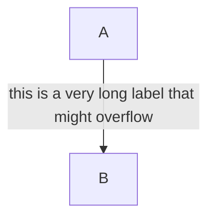
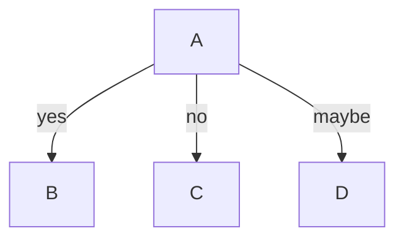
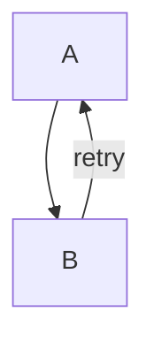
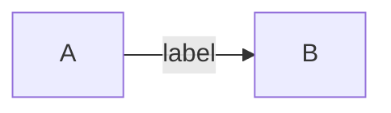
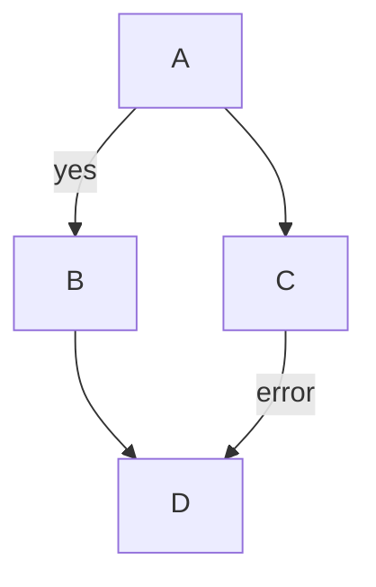
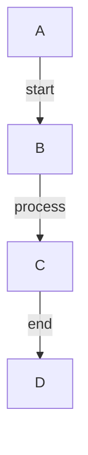

# Task 7.2: Edge Case Testing

## Objective
Test edge cases that may interact poorly with the label-as-dummy-node approach.

## Location
Tests in: `tests/integration.rs` or `src/dagre/` test modules

## Test Cases

### 1. Very Long Label Text

Verify: Label doesn't extend beyond canvas, or is handled gracefully.

### 2. Multiple Labeled Edges from Same Source (Fan-Out)

Verify: All three labels are visible and non-overlapping.

### 3. Labeled Backward Edge (Cycle)

Verify: The backward "retry" label renders correctly.

### 4. Labeled Edge in LR Direction

Verify: Label appears between nodes in horizontal layout.

### 5. Mix of Labeled and Unlabeled Edges

Verify: Unlabeled edges are unaffected by the label dummy mechanism.

### 6. All Edges Labeled

Verify: Layout handles all edges having minlen=2.

## Acceptance Criteria
- [ ] All edge cases render without panics
- [ ] Labels are visible and correctly positioned
- [ ] No visual regressions for unlabeled edges
- [ ] LR/RL directions work correctly
- [ ] Backward edges with labels work correctly
