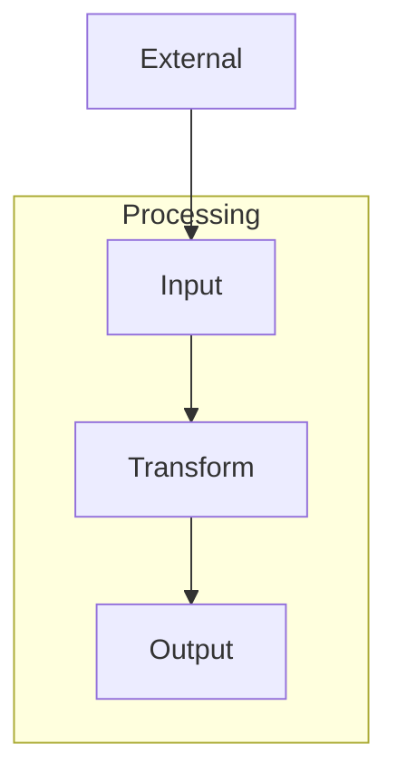

# Task 5.1: Integration Tests and Snapshot Updates

## Objective
Add a test fixture that demonstrates the title-arrow collision fix, write integration tests, and update existing subgraph snapshots.

## Location
Create: `tests/fixtures/title_collision.mmd`
Modify: `tests/integration.rs`

## TDD Phases

### 🔴 Red: Write Failing Tests

Create `tests/fixtures/title_collision.mmd`:


Write integration tests:

```rust
#[test]
fn subgraph_title_not_overwritten_by_edge() {
    let output = render_fixture("title_collision.mmd");
    // The title should be fully intact — not overwritten by the D→A edge
    assert!(
        output.contains("Processing"),
        "Title 'Processing' should not be overwritten by edge:\n{}",
        output
    );
}

#[test]
fn subgraph_title_has_vertical_separation_from_content() {
    let output = render_fixture("title_collision.mmd");
    let lines: Vec<&str> = output.lines().collect();

    // Find the title line and first content node
    let title_row = lines.iter().position(|l| l.contains("Processing"));
    let input_row = lines.iter().position(|l| l.contains("Input"));

    assert!(title_row.is_some(), "Should find title 'Processing'");
    assert!(input_row.is_some(), "Should find node 'Input'");

    let gap = input_row.unwrap() as i32 - title_row.unwrap() as i32;
    assert!(
        gap >= 2,
        "Should be >= 2 rows between title and first node, got {}",
        gap
    );
}
```

**What the failing test asserts:** The title text survives edge rendering, and there's vertical separation between title and content.
**Expected failure reason:** Without the title rank, edges can overwrite the title.

### 🟢 Green: Implementation

All prior phases (1-4) should make these tests pass. If they don't, debug the end-to-end pipeline.

### 🔵 Refactor: Update Existing Snapshots

Run all integration tests. Existing subgraph tests will likely have shifted coordinates due to the title rank. Update snapshots:

1. Run `cargo test --test integration` to see failures
2. For each failing snapshot test, verify the new output is correct (title space present, no regressions)
3. Update expected values

Key existing tests to verify:
- Tests involving subgraph rendering
- Tests with cross-subgraph edges
- Tests with nested subgraphs

## Context
The `title_collision.mmd` fixture models the exact scenario from the parent research — an external node with an edge entering a titled subgraph from above, where the edge previously overwrote the title text.

## Acceptance Criteria
- [ ] `title_collision.mmd` fixture created
- [ ] Integration test verifies title is intact
- [ ] Integration test verifies vertical separation
- [ ] All existing subgraph integration tests pass (snapshots updated)
- [ ] `cargo test` passes cleanly
