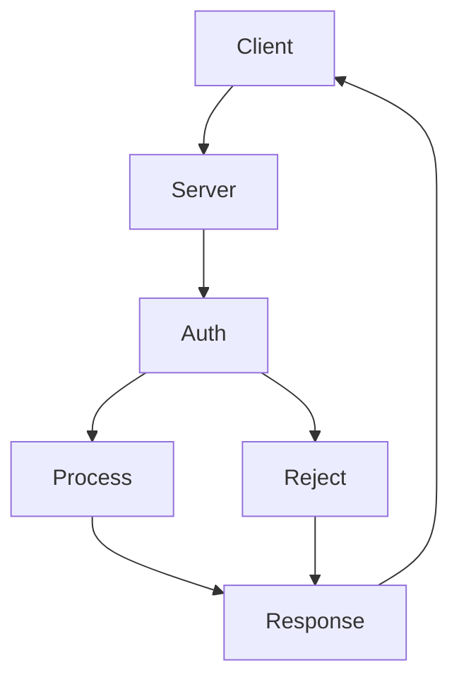

# Declaration Order Layout Fix

## Status: ❌ CANCELLED

**Cancelled:** 2026-01-25
**Reason:** Superseded by 0005-dagre-module

## Overview

Fix the layout algorithm so nodes appear in declaration order (like mermaid-js) rather than being scrambled by alphabetical cycle-breaking.

**Problem:** For diagrams with cycles, the `topological_layers()` function breaks ties alphabetically instead of using declaration order, causing nodes like "Auth" to appear above "Client" even when Client is declared first.

**Example:**


- **Expected:** Client at top (declared first)
- **Actual:** Auth at top (alphabetically first when cycle breaks)

## Root Cause Analysis

The `topological_layers()` function in `src/render/layout.rs` (lines 197-269):

1. **Treats all edges equally** - The Response→Client back-edge gives Client an in-degree of 1
2. **No natural sources** - With the cycle, no node has in-degree 0 initially
3. **Alphabetical tiebreaker** - Line 240: `deg_a.cmp(&deg_b).then_with(|| a.cmp(b))` picks "Auth" over "Client"
4. **HashMap loses order** - `Diagram.nodes` is a `HashMap`, so declaration order is lost

## How Mermaid-js Handles This

Mermaid uses Dagre which:
1. Detects cycles via DFS
2. Temporarily reverses back-edges
3. Runs longest-path algorithm where sources get highest ranks
4. Client (true source) naturally appears at top

## Implementation Approach

### Phase 1: Preserve Declaration Order

Change `Diagram.nodes` from `HashMap` to `IndexMap` to preserve insertion order.

### Phase 2: Back-Edge Detection

An edge A→B is a **back-edge** if B was declared before A. These should be excluded when computing initial in-degrees.

### Phase 3: Update Topological Sort

Modify `topological_layers()` to:
1. Build declaration order map from IndexMap iteration
2. Identify back-edges using declaration order
3. Exclude back-edges from in-degree computation
4. Use declaration order (not alphabetical) as cycle-breaking tiebreaker
5. Sort layers by declaration order

## Files to Modify

| File | Change |
|------|--------|
| `Cargo.toml` | Add `indexmap = "2"` dependency |
| `src/graph/diagram.rs` | Change `nodes: HashMap<String, Node>` to `IndexMap<String, Node>` |
| `src/render/layout.rs` | Update `topological_layers()` algorithm |

## Algorithm Change

**Current:**
```
1. Initialize in-degrees from ALL edges
2. Find nodes with in-degree 0
3. If none (cycle), pick alphabetically smallest
4. Sort layer alphabetically
```

**New:**
```
1. Build declaration_order map from IndexMap
2. Identify back-edges: A→B where declaration_order[B] < declaration_order[A]
3. Initialize in-degrees from FORWARD edges only
4. Find nodes with in-degree 0
5. If none (cycle), pick earliest declared
6. Sort layer by declaration order
```

## Expected Result

For the http_request example:
```
Layer 0: [Client]           # First declared, Response→Client is back-edge
Layer 1: [Server]           # Depends on Client (forward edge)
Layer 2: [Auth]             # Depends on Server (forward edge)
Layer 3: [Process, Reject]  # Both depend on Auth (forward edges)
Layer 4: [Response]         # Depends on Process, Reject (forward edges)
```

## Testing Strategy

1. Update `test_layout_handles_cycle` to verify A appears before B
2. Add new `test_topological_layers_cycle_respects_declaration_order` test
3. Run existing integration tests to verify backward compatibility
4. Manually verify `http_request.mmd` renders correctly

## Risk Assessment

- **Low risk**: `IndexMap` is a drop-in replacement for `HashMap`
- **Backward compatible**: All existing tests should pass
- **Performance**: Similar to `HashMap`
