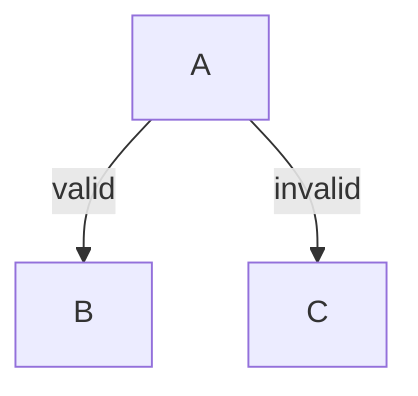
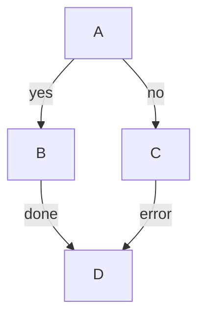

# Edge Label Spacing Fix Implementation Plan

## Status: ✅ COMPLETE

**Completed:** 2026-01-27

**Commits:**
- `0a03873`
- `51d524d`

## Overview

Fix edge label overlap issues in mmdflux by:
1. Adding space reservation for labeled edges (ensuring room for labels)
2. Computing proper label positions for all edges (not just long ones)
3. Adding safety net to prevent edge character overwrites

## Problem Statement

Edge labels overlap each other and edge path characters:

```
     ┌───┐
     │ A │
     └───┘
      │ │
   valinvalid    ← Labels overlap each other
    ▼      ▼     ← No visible edge line before arrows
```

**Reproduction case:**


**Expected output:**
```
       ┌───┐
       │ A │
       └───┘
        │ │
  valid │ │ invalid
        │ │
        ▼ ▼
    ┌───┐ ┌───┐
    │ B │ │ C │
    └───┘ └───┘
```

## Research Reference

Detailed research is available in `research/archive/0005-edge-label-spacing/`:
- `README.md` - Synthesis and recommendations
- `gap-analysis.md` - Critical gaps identified:
  - **Gap 3:** No space reservation for labels
  - **Gap 5:** No corner awareness
  - **Gap 6:** Collision detection incomplete

## Root Cause Analysis

### Primary Gap: No Space Reservation for Labels

From `gap-analysis.md`:
> "Dagre halves `ranksep` and doubles edge `minlen` when labels exist, creating vertical space. mmdflux uses fixed spacing regardless of labels."

When A branches to B and C with labels, both labels compete for the same vertical space because there's no extra room allocated.

### Secondary Gap: Short Edges Lack Label Positions

In `src/dagre/normalize.rs:210-214`:
```rust
// Only normalize edges that span more than 1 rank
if to_rank > from_rank + 1 {
    long_edges.push(...);
}
```

Short edges don't get label dummy nodes, so they fall back to heuristic placement.

### Tertiary Issues

1. **No edge character protection** - Collision detection doesn't check edge path characters
2. **Coordinate transformation incomplete** - Label positions just rounded, not properly transformed

---

## Phase 1: Edge Character Protection (Safety Net) ✅ COMPLETE

**Goal:** Prevent labels from overwriting edge path characters.

- [x] Add `is_edge` flag to `Cell` struct in `src/render/canvas.rs`
- [x] Mark edge cells in `set_with_connection()`
- [x] Add `label_collides_with_edge()` for collision detection
- [x] Update `label_has_collision()` to check edge collisions
- [x] Add unit test for edge collision detection

---

## Phase 2: Space Reservation for Labeled Edges (NEW - Main Fix)

**Goal:** Ensure there's enough vertical space for labels when edges branch from the same source.

### 2.1 Analyze Labeled Edge Requirements

**File:** `src/render/layout.rs`

Before computing layout, analyze edges to determine extra space needed:
- Count labeled edges per source node
- For branching edges (same source, different targets), labels need separate rows

### 2.2 Increase Row Spacing for Labeled Edges

**Option A: Global approach**
Increase `row_spacing` when any edges have labels:
```rust
let row_spacing = if diagram.edges.iter().any(|e| e.label.is_some()) {
    config.row_spacing + 2  // Extra space for labels
} else {
    config.row_spacing
};
```

**Option B: Per-edge approach (better)**
In dagre normalization, when computing rank separation:
- Edges with labels get increased `minlen`
- This reserves vertical space for the label

### 2.3 Modify Dagre Config for Labels

**File:** `src/dagre/mod.rs` or `src/render/layout.rs`

When calling dagre layout with labeled edges:
```rust
// If edges have labels, increase rank separation
let adjusted_config = if has_labeled_edges {
    LayoutConfig {
        rank_sep: config.rank_sep * 1.5,  // 50% more vertical space
        ..config.clone()
    }
} else {
    config.clone()
};
```

### 2.4 Ensure Visible Edge Line Before Arrow

After space reservation, there should be at least one edge character (`│`) visible between the node and the label, and between the label and the arrow.

---

## Phase 3: Compute Label Positions for Short Edges

**Goal:** Every labeled edge gets a pre-computed position based on its routed path.

### 3.1 Position Labels on Routed Path (Not Just Midpoint)

The current heuristic places labels at the midpoint between source and target centers. For branching edges, this causes overlaps.

**Fix:** Place labels along the actual routed edge path, after routing is computed:
- For edge A→B, find the vertical segment of that specific edge
- Position label adjacent to that segment

### 3.2 Offset Sibling Edge Labels

When multiple edges branch from the same source:
- First edge's label: default position
- Second edge's label: offset to avoid collision with first
- Use placed_labels tracking to ensure no overlap

### 3.3 Add Direction Helper Methods

**File:** `src/dagre/types.rs`

```rust
impl Direction {
    pub fn is_vertical(&self) -> bool {
        matches!(self, Direction::TopBottom | Direction::BottomTop)
    }
}
```

### 3.4 Compute Short Edge Label Positions

**File:** `src/dagre/mod.rs`

After layout, compute positions for edges without label dummies:
```rust
fn compute_short_edge_label_positions(
    lg: &LayoutGraph,
    edge_labels: &HashMap<usize, EdgeLabelInfo>,
    config: &LayoutConfig,
) -> HashMap<usize, Point> {
    // For each labeled short edge, find position along its path
    // Offset from edge line, avoid collisions with other labels
}
```

---

## Phase 4: Fix Coordinate Transformation

**Goal:** Properly transform label positions from dagre coordinates to draw coordinates.

### 4.1 Apply Proper Transformation

**File:** `src/render/layout.rs`

Transform label positions using the same logic as waypoints:
- Use `layer_starts` for primary axis
- Interpolate secondary axis
- Not just rounding dagre coordinates

---

## Phase 5: Testing and Verification

### 5.1 Test Fixture

**File:** `tests/fixtures/label_spacing.mmd`



### 5.2 Integration Test

**File:** `tests/integration.rs`

```rust
#[test]
fn test_edge_labels_no_overlap() {
    let input = r#"graph TD
    A -->|valid| B
    A -->|invalid| C
"#;
    let output = render(...);

    // Labels should not overlap
    assert!(output.contains("valid"));
    assert!(output.contains("invalid"));

    // Each label should appear on its own line or with spacing
    for line in output.lines() {
        assert!(!line.contains("valinvalid"), "Labels should not overlap");
    }
}
```

### 5.3 Visual Verification

Test with reproduction case and verify:
- [ ] Labels don't overlap each other
- [ ] At least one `│` character visible between node and arrow
- [ ] Labels positioned next to their respective edge paths

---

## Files to Modify

| File | Phase | Changes |
|------|-------|---------|
| `src/render/canvas.rs` | 1 ✅ | Add `is_edge` flag to Cell |
| `src/render/edge.rs` | 1 ✅ | Add `label_collides_with_edge()` |
| `src/render/layout.rs` | 2 | Increase spacing for labeled edges |
| `src/dagre/mod.rs` | 2, 3 | Adjust config, compute label positions |
| `src/dagre/types.rs` | 3 | Add `is_vertical()` helper |
| `tests/integration.rs` | 5 | Add label overlap test |

## Risk Assessment

| Risk | Likelihood | Impact | Mitigation |
|------|------------|--------|------------|
| Breaking existing layouts | Medium | High | Run full test suite before/after |
| Over-spacing when no labels | Low | Medium | Only adjust when labels present |
| Edge cases with many branches | Medium | Medium | Test with complex fixtures |

## Implementation Order

1. **Phase 2 first** - Space reservation is the main fix
2. **Phase 3** - Proper label positioning with space available
3. **Phase 4** - Coordinate transformation polish
4. **Phase 5** - Testing throughout

Phase 1 is already complete and provides a safety net.
