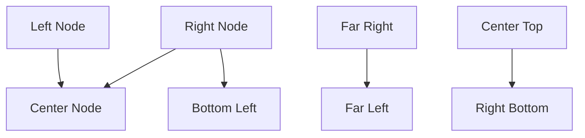
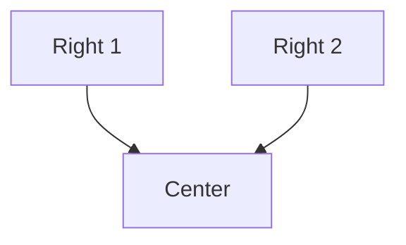
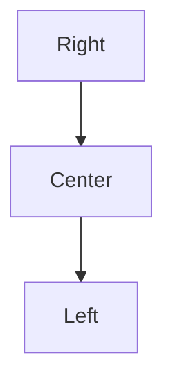

# Task 2.1: Create horizontal_offset.mmd test fixture

## Objective

Create a dedicated test fixture that exercises the synthetic waypoint generation for various horizontal offset scenarios.

## Location

`tests/fixtures/horizontal_offset.mmd`

## Fixture Content



## Expected Behavior

| Edge | Source Position | Target Position | Expected Routing |
|------|-----------------|-----------------|------------------|
| A→B | Left | Center | Default (small offset, or left-side routing) |
| C→B | Right | Center | **Synthetic waypoint** - stay right, then horizontal |
| C→D | Right | Left | **Synthetic waypoint** - stay right, then horizontal |
| E→F | Far Right | Far Left | **Synthetic waypoint** - maximum offset case |
| G→H | Center | Right | Default (center source, no synthetic waypoints) |

## Visual Expectations

### Before (current mid-y routing for C→D):
```
                    ┌──────────────┐
                    │ Right Node C │
                    └──────────────┘
                           │
          ┌────────────────┘  ← horizontal through middle
          │
          ▼
    ┌────────────────┐
    │ Bottom Left D  │
    └────────────────┘
```

### After (synthetic waypoint routing):
```
                    ┌──────────────┐
                    │ Right Node C │
                    └──────────────┘
                           │
                           │  ← stays on right side
                           │
                           └────────┐
                                    │
                           ┌────────┘
                           ▼
    ┌────────────────┐
    │ Bottom Left D  │
    └────────────────┘
```

## Test Assertions

In `tests/integration.rs`, add:

```rust
#[test]
fn test_horizontal_offset_fixture() {
    let input = include_str!("fixtures/horizontal_offset.mmd");
    let output = render_to_string(input, &default_options());

    // Verify the output renders without errors
    assert!(!output.is_empty());

    // Verify key nodes are present
    assert!(output.contains("Left Node"));
    assert!(output.contains("Right Node"));
    assert!(output.contains("Center Node"));

    // Optional: Snapshot test
    insta::assert_snapshot!(output);
}
```

## Additional Test Cases to Consider

### Edge case: Multiple right-side sources to same target



Both A→C and B→C should use synthetic waypoints without collision.

### Edge case: Chain with offset



A→B uses synthetic waypoints, B→C uses default routing.

## Acceptance Criteria

- [ ] `horizontal_offset.mmd` fixture created
- [ ] Fixture includes edges with various offset sizes
- [ ] Fixture includes left, center, and right source positions
- [ ] Integration test added for the fixture
- [ ] Visual inspection confirms improved routing for large-offset edges
