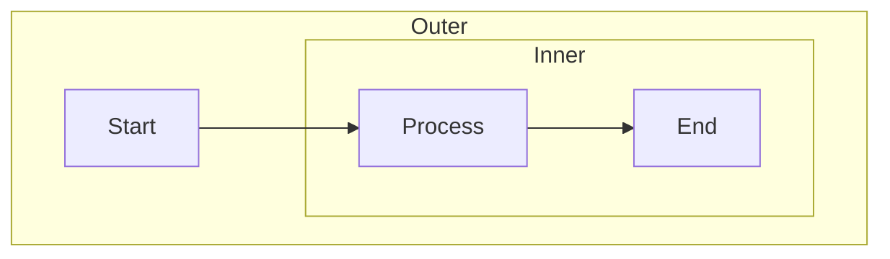
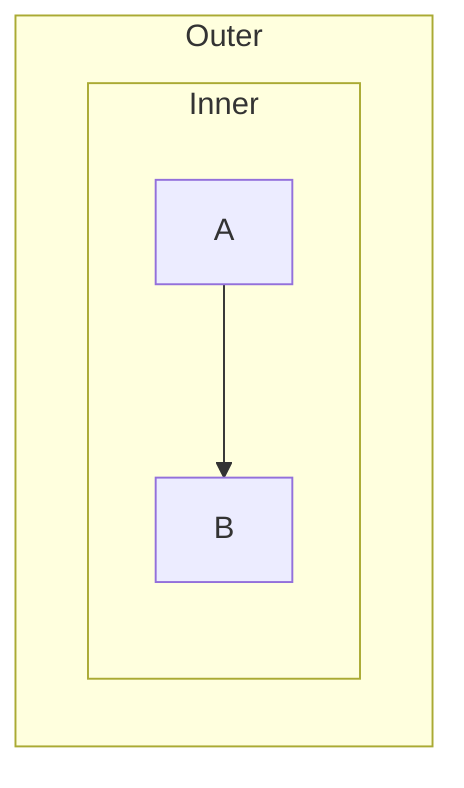
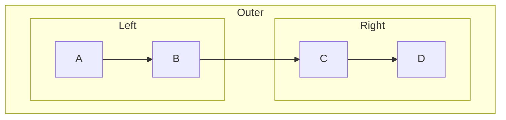

# Task 6.1: Create Nested Subgraph Test Fixtures

## Objective
Create `.mmd` fixture files for nested subgraph scenarios.

## Location
New files in: `tests/fixtures/`

## Fixtures to Create

### `nested_subgraph.mmd` — basic two-level nesting

### `nested_subgraph_only.mmd` — outer has no direct nodes

### `nested_with_siblings.mmd` — nested subgraph alongside sibling subgraphs

## Acceptance Criteria
- [ ] All three fixture files created
- [ ] All parse successfully (verified in Task 6.2)
- [ ] Cover the three main scenarios: basic nesting, outer-only nesting, sibling nesting
