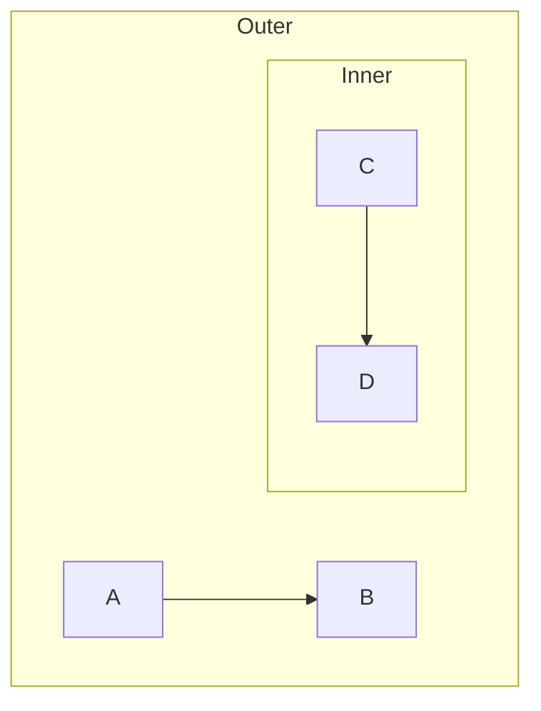

# Q3: mmdflux Parser Extension Design

## Summary

The mmdflux parser requires three coordinated extensions to support subgraphs: (1) pest PEG grammar rules for `subgraph ... end` blocks with optional identifiers and titles, (2) a recursive `Subgraph` variant in the `Statement` AST enum containing nested statement vectors, and (3) parser logic that builds the recursive tree structure during tree transformation. Pest's prohibition on left recursion favors a right-recursive grammar design (`statement = subgraph | vertex_statement`) that naturally composes with the existing statement rule, enabling arbitrary nesting depth without grammar changes.

## Where

- `/Users/kevin/src/mmdflux/src/parser/grammar.pest` -- Current PEG grammar (98 lines): vertex statements, edge chains, comments; `statement` rule handles only `vertex_statement`
- `/Users/kevin/src/mmdflux/src/parser/ast.rs` -- Current AST (111 lines): `ShapeSpec` enum, `Vertex`, `ConnectorSpec`, `EdgeSpec`, `Statement` with only `Vertex` and `Edge` variants
- `/Users/kevin/src/mmdflux/src/parser/flowchart.rs` -- Current parser logic: `parse_flowchart()` entry point, `parse_statement()`, `parse_vertex_statement()`, `parse_node()`, `parse_connector()`
- `/Users/kevin/src/mermaid/packages/mermaid/src/diagrams/flowchart/parser/flow.jison` -- Mermaid.js grammar (lines 119-120, 379-386)
- `/Users/kevin/src/mermaid/packages/mermaid/src/diagrams/flowchart/types.ts` -- `FlowSubGraph` interface

## What

### Current Grammar Structure

```pest
// Current rules (lines 88-96)
vertex_statement = { node_group ~ edge_segment* }
statement = { vertex_statement }
flowchart = {
    SOI ~ header ~ NEWLINE ~ ((statement | comment) ~ NEWLINE?)* ~ EOI
}
```

- `statement` is single-alternative, wrapping only `vertex_statement`
- No keywords for `subgraph` or `end`
- No support for nested block structures

### Current AST Structure

```rust
pub enum Statement {
    Vertex(Vertex),
    Edge(EdgeSpec),
}
```

- Flat enum with only two variants; no compound structure type
- Each statement is independent

### Mermaid Subgraph Syntax (from flow.jison)

Three subgraph variants:
1. `subgraph id [title]` -- Explicit ID and title
2. `subgraph id` -- Explicit ID, title defaults to ID
3. `subgraph` -- Anonymous (ID auto-generated)

Content is parsed recursively as a `document` (allowing nested statements), delimited by `end`.

## How

### Proposed Grammar Extension

```pest
statement = { subgraph_stmt | vertex_statement }

subgraph_stmt = {
    ^"subgraph" ~ subgraph_spec ~ NEWLINE ~ statement_list ~ ^"end"
}

subgraph_spec = {
    identifier ~ "[" ~ text_rect ~ "]"  // id [title]
    | identifier                         // id
    | ""                                 // anonymous
}

statement_list = { ((statement | comment) ~ NEWLINE?)* }
```

**Right-Recursive Pattern:** Pest's `*` operator generates right-associative parsing internally, avoiding left recursion while allowing nested subgraphs of arbitrary depth.

**New terminals:**
- `^"subgraph"` for case-insensitive matching (consistent with `graph_keyword`, `flowchart_keyword`)
- `^"end"` with lookahead `&(WHITESPACE | NEWLINE | EOF)` to avoid consuming trailing characters

### Proposed AST Extension

```rust
#[derive(Debug, Clone, PartialEq, Eq)]
pub struct Subgraph {
    pub id: String,
    pub title: Option<String>,
    pub statements: Vec<Statement>,
}

#[derive(Debug, Clone, PartialEq, Eq)]
pub enum Statement {
    Vertex(Vertex),
    Edge(EdgeSpec),
    Subgraph(Subgraph),
}
```

**Design choices:**
- **Recursive `Vec<Statement>`:** Enables arbitrary nesting depth
- **`id: String` (required):** Auto-generated if not in syntax (e.g., `sg_0`, `sg_1`)
- **`title: Option<String>`:** Separates logical ID from display label
- **Implicit parent-child:** Tree structure encodes nesting; downstream flattening extracts `parent` references

### Parser Logic Extension

```rust
fn parse_statement(pair: Pair<Rule>) -> Vec<Statement> {
    let mut statements = Vec::new();
    for inner in pair.into_inner() {
        match inner.as_rule() {
            Rule::vertex_statement => {
                statements.extend(parse_vertex_statement(inner));
            }
            Rule::subgraph_stmt => {
                statements.push(parse_subgraph(inner));
            }
            _ => {}
        }
    }
    statements
}

fn parse_subgraph(pair: Pair<Rule>) -> Statement {
    let mut id = String::new();
    let mut title = None;
    let mut statements = Vec::new();

    for inner in pair.into_inner() {
        match inner.as_rule() {
            Rule::subgraph_spec => {
                // Parse id and optional title
                (id, title) = parse_subgraph_spec(inner);
            }
            Rule::statement_list => {
                for stmt_pair in inner.into_inner() {
                    if stmt_pair.as_rule() == Rule::statement {
                        statements.extend(parse_statement(stmt_pair));
                    }
                }
            }
            _ => {}
        }
    }

    // Auto-generate ID if not provided
    if id.is_empty() {
        id = format!("sg_{}", next_subgraph_counter());
    }

    Statement::Subgraph(Subgraph { id, title, statements })
}
```

### Nested Subgraph Example

Input:


AST output:
```rust
Statement::Subgraph(Subgraph {
    id: "sg1",
    title: Some("Outer"),
    statements: vec![
        Statement::Edge(...),  // A --> B
        Statement::Subgraph(Subgraph {
            id: "sg2",
            title: Some("Inner"),
            statements: vec![
                Statement::Edge(...),  // C --> D
            ],
        }),
    ],
})
```

## Why

### Recursive AST vs. Flat List with Parent References

**Recursive AST chosen because:**
- Mirrors Mermaid syntax exactly (block nesting)
- Pest's right-recursive `statement*` naturally builds the tree -- no post-processing passes needed
- Nesting context is directly represented; no ambiguity about membership
- Graph builder can flatten the tree if needed (single traversal pass)

**Flat list with parent references would require:**
- Post-parsing pass to extract parent relationships
- Additional error checking (cycles, orphaned nodes)
- Explicit parent tracking, increasing AST complexity

### Three Subgraph Variants -> Unified AST

All Mermaid syntax variants map to the same `Subgraph` struct:
- `subgraph id [title]` -> `{ id: "id", title: Some("title"), ... }`
- `subgraph id` -> `{ id: "id", title: None, ... }`
- `subgraph` -> `{ id: "sg_0", title: None, ... }` (auto-generated)

### Separation of Parsing and Layout

- Parser produces recursive AST (structural)
- Graph builder flattens into `Diagram` with `parent` field on nodes (for dagre)
- Rendering layer uses flat structure with subgraph border info
- Clean separation of concerns

## Key Takeaways

- Pest PEG enforces right-recursive grammar design -- `statement = subgraph | vertex_statement` with `statement*` avoids left recursion naturally
- Recursive AST mirrors block syntax exactly; simplifies parsing with no post-processing
- Three subgraph syntaxes reduce to one AST type with optional title and auto-generated ID
- Auto-generate subgraph IDs during parsing for stable downstream references
- Recursive parsing naturally supports arbitrary nesting depth
- Graph builder must flatten for layout (single traversal pass)

## Open Questions

- How deep can nesting go before performance degrades? Recursive AST is theoretically unbounded but practical limits depend on Rust stack depth
- How do edges crossing subgraph boundaries behave in the AST? If source is in subgraph A and target in subgraph B, should the edge be in a parent scope (LCA) or duplicated?
- Should subgraph IDs be user-visible or implementation-internal?
- Does Mermaid support `direction` override within subgraphs, and how should the AST capture this?
- How does the rendering layer handle subgraph borders vs. node shapes on the terminal canvas?
