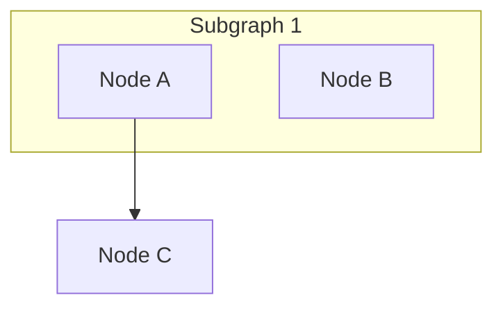
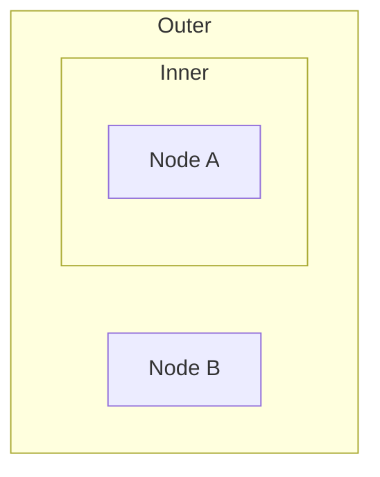

# Q4: Graph Layer Changes for Compound Structure

## Summary

The graph layer must represent compound structures with a two-tier design: nodes support an optional `parent` field referencing their subgraph, and a separate `Subgraph` struct maintains ordered membership lists. This mirrors graphlib's compound graph API (`setParent()`, `parent()`, `children()`). Edges crossing subgraph boundaries are represented normally (node-to-node); the layout phase introduces border nodes later. The `build_diagram` function processes both flat nodes and subgraph membership declarations, resolving edges targeting subgraph IDs to their actual destinations.

## Where

- `/Users/kevin/src/mmdflux/src/graph/diagram.rs` -- Current flat Diagram structure
- `/Users/kevin/src/mmdflux/src/graph/node.rs` -- Node struct (no parent field)
- `/Users/kevin/src/mmdflux/src/graph/edge.rs` -- Edge struct (no changes needed)
- `/Users/kevin/src/mmdflux/src/graph/builder.rs` -- `build_diagram()` function
- `/Users/kevin/src/dagre/lib/nesting-graph.js` -- graphlib parent-child model
- `/Users/kevin/src/dagre/lib/add-border-segments.js` -- Border node structure
- `/Users/kevin/src/dagre/lib/layout.js` -- compound graph creation with `{ compound: true }`
- `/Users/kevin/src/mermaid/packages/mermaid/src/diagrams/flowchart/types.ts` -- `FlowSubGraph` interface
- `/Users/kevin/src/mmdflux/research/archive/0000-initial-research/synthesis.md` -- Original subgraph design intent

## What

### Current State

**Diagram:**
```rust
pub struct Diagram {
    pub direction: Direction,
    pub nodes: HashMap<String, Node>,  // Flat key-value store
    pub edges: Vec<Edge>,              // Simple from/to references
}
```

**Node:**
```rust
pub struct Node {
    pub id: String,
    pub label: String,
    pub shape: Shape,
    // NO parent field, NO subgraph membership info
}
```

**Edge:**
```rust
pub struct Edge {
    pub from: String,
    pub to: String,
    pub label: Option<String>,
    pub stroke: Stroke,
    pub arrow: Arrow,
}
```

### Option Analysis

1. **Option A: Parent field on Node only** -- `parent: Option<String>`
   - Pro: Minimal change
   - Con: No direct way to query "all nodes in subgraph X" (O(n) scan)
   - Verdict: Insufficient for layout needs

2. **Option B: Separate Subgraph struct with children list**
   - Pro: Fast membership queries; mirrors mermaid-js's flat `subGraphs[]`
   - Con: Requires syncing parent field with children list
   - Verdict: Works but introduces dual representation

3. **Option C: Both parent field AND Subgraph struct (RECOMMENDED)**
   - Pro: Consistent with graphlib; fast queries in both directions
   - Con: Slightly larger API surface
   - Verdict: Best balance of query performance and clarity

### Recommended Structure

```rust
pub struct Node {
    pub id: String,
    pub label: String,
    pub shape: Shape,
    pub parent: Option<String>,  // ID of parent subgraph, or None
}

pub struct Subgraph {
    pub id: String,
    pub title: String,
    pub nodes: Vec<String>,      // Ordered list of member node IDs
    pub parent: Option<String>,  // Allows nesting
}

pub struct Diagram {
    pub direction: Direction,
    pub nodes: HashMap<String, Node>,
    pub edges: Vec<Edge>,
    pub subgraphs: HashMap<String, Subgraph>,  // Fast lookup by ID
}
```

## How

### build_diagram Changes

Two-phase processing:

```rust
pub fn build_diagram(flowchart: &Flowchart) -> Diagram {
    let direction = convert_direction(flowchart.direction);
    let mut diagram = Diagram::new(direction);

    // Phase 1: Create all nodes
    for statement in &flowchart.statements {
        if let Statement::Vertex(vertex) = statement {
            add_vertex_to_diagram(&mut diagram, vertex);
        }
    }

    // Phase 2: Process subgraphs and edges
    for statement in &flowchart.statements {
        match statement {
            Statement::Subgraph(subgraph_spec) => {
                add_subgraph_to_diagram(&mut diagram, subgraph_spec);
            }
            Statement::Edge(edge_spec) => {
                add_edge_to_diagram(&mut diagram, edge_spec);
            }
            _ => {}
        }
    }

    diagram
}

fn add_subgraph_to_diagram(diagram: &mut Diagram, spec: &SubgraphSpec) {
    let subgraph = Subgraph {
        id: spec.id.clone(),
        title: spec.title.clone(),
        nodes: spec.node_ids.clone(),
        parent: spec.parent.clone(),
    };

    // Update each node's parent field
    for node_id in &subgraph.nodes {
        if let Some(node) = diagram.nodes.get_mut(node_id) {
            node.parent = Some(subgraph.id.clone());
        }
    }

    diagram.subgraphs.insert(subgraph.id.clone(), subgraph);
}
```

### Edge Handling

Edges targeting a subgraph ID are kept abstract at graph layer. The graph layer does NOT resolve edges to border nodes because:
- Border nodes don't exist until `nesting_graph::run()` in dagre
- The graph layer is layout-algorithm-independent
- Cleaner separation of concerns

### Boundary-Crossing Edge Example



Representation:
```rust
nodes: {
    "A" -> Node { id: "A", parent: Some("sg1"), ... },
    "B" -> Node { id: "B", parent: Some("sg1"), ... },
    "C" -> Node { id: "C", parent: None, ... }
}
edges: [
    Edge { from: "A", to: "C", ... }
]
subgraphs: {
    "sg1" -> Subgraph { id: "sg1", nodes: ["A", "B"], parent: None, ... }
}
```

### Nested Subgraph Example



Representation:
```rust
subgraphs: {
    "sg1" -> Subgraph { id: "sg1", nodes: ["B"], parent: None, ... },
    "sg2" -> Subgraph { id: "sg2", nodes: ["A"], parent: Some("sg1"), ... }
}
nodes: {
    "A" -> Node { parent: Some("sg2"), ... },
    "B" -> Node { parent: Some("sg1"), ... }
}
```

Note: Node A's parent is sg2 directly; transitively, A is in sg1 via nesting.

## Why

### Design Rationale

**Follows graphlib's established pattern:** The compound graph model in dagre.js/graphlib is battle-tested. Mirroring its API (`parent` field, `children` collection) ensures compatibility with the layout algorithm.

**Supports efficient layout queries:**
- `get_parent(node_id)` via `node.parent` -- O(1)
- `get_children(subgraph_id)` via `subgraph.nodes` -- O(1)
- `get_all_ancestors(node_id)` via parent chain -- O(depth)

**Clean separation of concerns:**
- Graph layer: represent structure, validate consistency
- Builder: translate parser output to graph
- Layout layer: consume graph, place nodes, generate border segments
- Render layer: draw borders based on layout coordinates

### Comparison with graphlib

| Aspect | graphlib (dagre.js) | mmdflux (proposed) |
|--------|-------------------|-------------------|
| Parent reference | `g.setParent(node, parent)` | `node.parent: Option<String>` |
| Children | `g.children(parent)` | `subgraph.nodes: Vec<String>` |
| Lookup | Unified Graph object | Diagram owns nodes + subgraphs |
| Edges | Simple `(from, to)` | Same |
| Border nodes | Added during layout | Same (deferred) |

**Key difference:** graphlib uses a unified `Graph` object. mmdflux's separation of `Diagram.nodes` and `Diagram.subgraphs` is equivalent but more explicit, appropriate for Rust's type system.

## Key Takeaways

- Two-tier representation: `parent: Option<String>` on Node + `Subgraph` struct provides bidirectional parent-child queries needed for layout
- Edges remain abstract at graph layer; dagre layout resolves subgraph edges to border node edges
- Mirrors graphlib's compound graph model for compatibility
- `parent` field on Subgraph allows arbitrarily deep nesting
- `build_diagram()` processes subgraph specs and updates node parent fields, maintaining consistency

## Open Questions

- Should `build_diagram` validate that edges reference existing nodes/subgraphs, or defer to layout?
- What does it mean to edge from one subgraph to another -- resolved to border nodes during layout?
- Should empty subgraphs (no nodes) be allowed?
- Subgraph title positioning (top-left corner, top-center, configurable?) -- deferred to Q6
