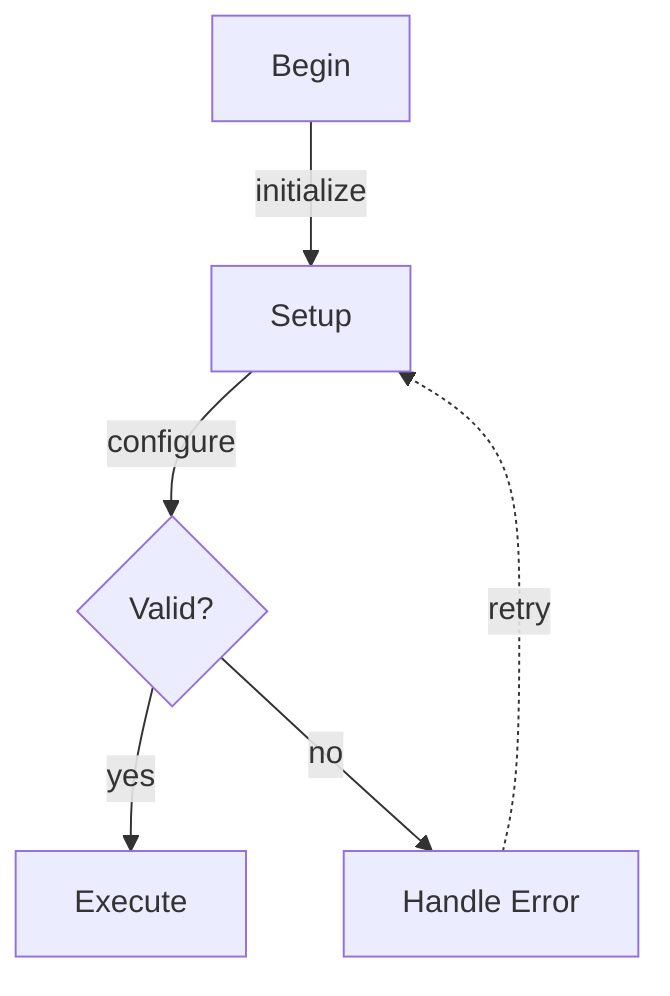

# Research: Label-as-Dummy-Node Rendering Regression

## Status: SYNTHESIZED

---

## Goal

Determine why the label-as-dummy-node implementation (plan 0024, branch in `~/src/mmdflux-label-dummy`) produces severely broken rendering for `labeled_edges.mmd` compared to both the main branch and Mermaid's reference rendering. Identify the specific bugs, design mismatches, or missing pieces causing the regression, and recommend fixes.

## Context

Plan 0024 implemented the "label-as-dummy-node" approach from research 0017's recommendation #5. The implementation followed dagre.js's `makeSpaceForEdgeLabels` pattern but with a key strategic difference: only labeled edges get `minlen=2` (dagre.js doubles ALL edges and halves `ranksep`).

The `labeled_edges.mmd` fixture renders correctly on the main branch (clean layout with labels between nodes) but the label-dummy branch produces:
- Severely misaligned edges and nodes
- Label text rendering corruption ("Val▲d?" instead of "Valid?")
- Edges crossing through nodes
- Extra phantom columns/rows
- Backward edge (retry) rendered as a vertical column instead of a curve

All 394 tests pass on the branch, but the visual output is clearly broken.

### Mermaid Input

### Key Design Difference from Dagre.js

- **Dagre.js:** Doubles ALL edge minlen, halves ranksep globally → uniform intermediate ranks for ALL edges
- **mmdflux:** Only sets minlen=2 for labeled edges, keeps ranksep unchanged → labeled and unlabeled edges span different rank counts

This asymmetry is the primary suspect for the broken layout.

## Questions

### Q1: What does dagre.js's makeSpaceForEdgeLabels actually achieve and why is the global approach necessary?

**Where:** `~/src/dagre/lib/layout.js` (lines 150-172), `~/src/dagre/lib/normalize.js`, `~/src/dagre/lib/rank/index.js`
**What:** Trace the full effect of doubling ALL edges and halving ranksep. What invariants does this create? How does normalization interact with the doubled minlens? What happens to unlabeled edges — do they get dummy nodes too?
**How:** Read the dagre.js source, trace through the pipeline for a mixed graph (some labeled, some unlabeled edges), document the rank assignments and dummy chains
**Why:** Understanding whether the global approach is *essential* (creates invariants other phases depend on) vs *optional* (just a convenience) is key to knowing if the mmdflux approach can work at all

**Output file:** `q1-dagre-make-space-analysis.md`

---

### Q2: How does the targeted minlen=2 approach break the Sugiyama pipeline invariants?

**Where:** `~/src/mmdflux-label-dummy/src/dagre/` (mod.rs, rank.rs, normalize.rs, order.rs, position.rs, bk.rs)
**What:** Trace through the full pipeline for `labeled_edges.mmd` with the targeted approach. Which edges get minlen=2? What ranks result? How many dummy nodes are created? What does the ordering phase produce? Does the BK coordinate assignment handle mixed-length edges correctly?
**How:** Add debug tracing or read the code to reconstruct what happens step by step. Compare the rank assignments, dummy chains, layer ordering, and final positions between the main branch and label-dummy branch
**Why:** Pinpoint exactly where the pipeline breaks down — is it ranking, ordering, positioning, or rendering?

**Output file:** `q2-pipeline-invariant-analysis.md`

---

### Q3: Is the render layer correctly handling the new label positions and waypoints?

**Where:** `~/src/mmdflux-label-dummy/src/render/` (layout.rs, router.rs, edge.rs, shape.rs)
**What:** Check whether the coordinate transform, waypoint routing, edge rendering, and label placement are all consistent. Does `transform_label_positions_direct()` produce correct canvas coordinates? Are waypoints being correctly transformed from dagre space to ASCII space? Is the router handling the extra waypoints from label dummies correctly?
**How:** Compare the render layer code between main and label-dummy branches. Trace the rendering of a specific edge (e.g., "initialize" label on Begin→Setup) through both code paths. Look for leftover heuristic code that conflicts with the new precomputed positions
**Why:** Even if the dagre layout is correct, the render layer could be misinterpreting the results, especially since the number of waypoints changes and the label position calculation was already buggy (see findings)

**Output file:** `q3-render-layer-analysis.md`

---

### Q4: What specifically causes the visual corruption in the labeled_edges.mmd output?

**Where:** `~/src/mmdflux-label-dummy/` — run the program with `--debug` flag, examine the actual output character by character
**What:** Identify each specific visual defect: (1) "Val▲d?" corruption, (2) edge misalignment, (3) phantom columns, (4) backward edge rendering. For each, determine whether it's a layout issue (wrong coordinates from dagre) or a rendering issue (wrong canvas placement)
**How:** Run `cargo run -- --debug tests/fixtures/labeled_edges.mmd` in the label-dummy worktree. Compare the debug output (which shows dagre coordinates) with the visual output. Cross-reference with the main branch's debug output
**Why:** This is the concrete diagnostic that maps symptoms to root causes

**Output file:** `q4-visual-defect-diagnosis.md`

## Sources

| Source | Location | Used by |
|--------|----------|---------|
| dagre.js layout.js | `~/src/dagre/lib/layout.js` | Q1 |
| dagre.js normalize.js | `~/src/dagre/lib/normalize.js` | Q1 |
| dagre.js rank | `~/src/dagre/lib/rank/` | Q1 |
| mmdflux-label-dummy dagre | `~/src/mmdflux-label-dummy/src/dagre/` | Q2, Q4 |
| mmdflux-label-dummy render | `~/src/mmdflux-label-dummy/src/render/` | Q3, Q4 |
| mmdflux main dagre | `~/src/mmdflux/src/dagre/` | Q2 |
| mmdflux main render | `~/src/mmdflux/src/render/` | Q3 |
| Plan 0024 findings | `~/src/mmdflux-label-dummy/plans/0024-label-as-dummy-node/findings/` | Q2, Q3 |
| Research 0017 synthesis | `~/src/mmdflux/research/0017-architecture-algorithm-audit/synthesis.md` | Q1 |

## Expected Outputs

| File | Question | Status |
|------|----------|--------|
| `q1-dagre-make-space-analysis.md` | Q1: dagre.js makeSpaceForEdgeLabels analysis | Complete |
| `q2-pipeline-invariant-analysis.md` | Q2: Pipeline invariant analysis | Complete |
| `q3-render-layer-analysis.md` | Q3: Render layer analysis | Complete |
| `q4-visual-defect-diagnosis.md` | Q4: Visual defect diagnosis | Complete |
| `synthesis.md` | Combined findings and fix recommendations | Complete |
