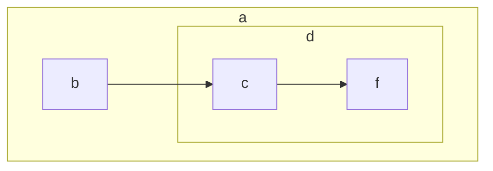

# Research: Nested Subgraph Support

## Status: SYNTHESIZED

---

## Goal

Determine what changes are needed across the pipeline (parser, builder, layout, render) to support nested subgraphs — a subgraph declared inside another subgraph. Mermaid supports this natively and users expect it. The parser already accepts the syntax recursively but downstream stages lose the nesting relationship.

## Context

The current codebase supports single-level subgraphs (flat grouping of nodes). Nested subgraphs like:

parse successfully but render incorrectly because:
- The `Subgraph` struct has no `parent` field
- The graph builder doesn't track subgraph-to-subgraph parent relationships
- The dagre layout never calls `set_parent(child_sg, parent_sg)`
- Bounds computation only considers direct node members, skipping subgraphs with no direct nodes
- The outer subgraph "a" gets empty nodes list and is skipped entirely

Mermaid renders this with "a" as an outer bordered box containing node "b" and inner bordered box "d" (which contains "c" and "f").

## Questions

### Q1: What graph builder changes are needed for nested subgraph parent tracking?

**Where:** `src/graph/builder.rs`, `src/graph/diagram.rs`, `src/parser/ast.rs`
**What:** How to propagate subgraph parent-child relationships from the recursive `process_statements` call into the `Subgraph` struct. What fields need to be added, how `collect_node_ids` should handle nested subgraphs, and whether a subgraph's `nodes` list should include transitive descendants.
**How:** Read the builder's recursive processing, trace the data flow for the example input, design the minimal struct changes.
**Why:** Without parent tracking, no downstream stage can know that subgraph "d" is inside subgraph "a".

**Output file:** `q1-builder-parent-tracking.md`

---

### Q2: What dagre layout changes are needed for multi-level compound nesting?

**Where:** `src/dagre/nesting.rs`, `src/dagre/border.rs`, `src/dagre/graph.rs`, `src/dagre/mod.rs`, `src/render/layout.rs`
**What:** Whether the dagre compound graph infrastructure (set_parent, nesting::run, border::add_segments) already handles multi-level nesting correctly when parent relationships are properly set. Whether rank assignment, ordering, and coordinate assignment handle nested compound nodes. What breaks if we just wire up `set_parent(child_sg, parent_sg)`.
**How:** Trace through nesting.rs to see how it discovers children and creates border/title nodes. Check if border nodes for inner subgraphs get included in outer subgraph bounds. Look at how `from_digraph` builds the LayoutGraph and whether compound-in-compound is handled.
**Why:** The dagre layout is the most complex stage. Understanding whether multi-level nesting "just works" once parents are set vs. requires algorithmic changes is critical for scoping the implementation.

**Output file:** `q2-dagre-compound-nesting.md`

---

### Q3: What rendering and bounds computation changes are needed for nested borders?

**Where:** `src/render/layout.rs` (convert_subgraph_bounds), `src/render/subgraph.rs`, `src/render/mod.rs`
**What:** How bounds computation should work when subgraphs contain other subgraphs. Whether bounds should be computed inside-out (inner first, then outer includes inner bounds). How nested borders should be rendered (z-order, overlap avoidance, title placement). Whether the existing overlap resolution logic applies to nested vs. sibling subgraphs.
**How:** Read convert_subgraph_bounds and trace what happens for the example input. Design the inside-out bounds computation. Check how Mermaid handles padding between nested borders.
**Why:** The bounds computation currently skips subgraphs with no direct nodes. This must change for nested subgraphs where the outer subgraph's bounds derive from its child subgraphs rather than direct nodes.

**Output file:** `q3-rendering-nested-bounds.md`

---

### Q4: How does Mermaid's own implementation handle nested subgraphs?

**Where:** Mermaid.js source (GitHub), Mermaid documentation
**What:** How Mermaid's flowchart renderer handles nested subgraph hierarchies internally. How it computes layout for nested compound graphs. What edge cases exist (deeply nested, cross-boundary edges between nested levels, backward edges within nested subgraphs). Whether dagre-d3 or elkjs handles the nesting natively.
**How:** Search the Mermaid.js repo for subgraph nesting logic, read their dagre/elk integration, check their test cases for nested subgraphs.
**Why:** Understanding the reference implementation helps identify edge cases we haven't considered and validates our approach.

**Output file:** `q4-mermaid-reference-implementation.md`

---

## Sources

| Source | Location | Used by |
|--------|----------|---------|
| Graph builder | `src/graph/builder.rs` | Q1 |
| Diagram types | `src/graph/diagram.rs` | Q1, Q3 |
| AST types | `src/parser/ast.rs` | Q1 |
| Dagre nesting | `src/dagre/nesting.rs` | Q2 |
| Dagre border | `src/dagre/border.rs` | Q2 |
| Dagre graph | `src/dagre/graph.rs` | Q2 |
| Layout computation | `src/render/layout.rs` | Q2, Q3 |
| Subgraph rendering | `src/render/subgraph.rs` | Q3 |
| Render orchestration | `src/render/mod.rs` | Q3 |
| Mermaid.js source | `github.com/mermaid-js/mermaid` | Q4 |
| Mermaid docs | `mermaid.js.org` | Q4 |

## Expected Outputs

| File | Question | Status |
|------|----------|--------|
| `q1-builder-parent-tracking.md` | Q1: Builder parent tracking | Complete |
| `q2-dagre-compound-nesting.md` | Q2: Dagre compound nesting | Complete |
| `q3-rendering-nested-bounds.md` | Q3: Rendering nested bounds | Complete |
| `q4-mermaid-reference-implementation.md` | Q4: Mermaid reference impl | Complete |
| `synthesis.md` | Combined findings | Complete |
