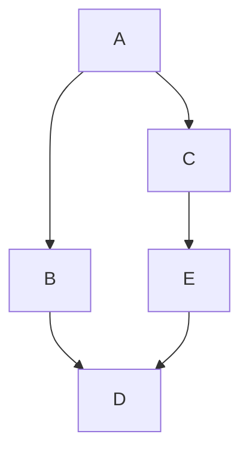
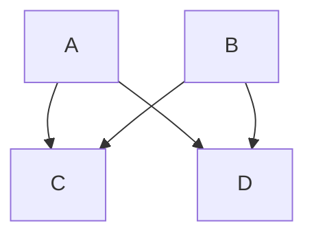
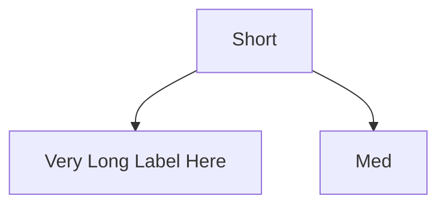

# mmdflux vs Dagre: Implementation Differences

This document explains how mmdflux's Simplified Sugiyama implementation differs from the Dagre algorithm used by Mermaid.js. Use this as a reference when debugging layout differences between mmdflux and Mermaid.

## Overview

| Aspect                | Dagre (Mermaid)              | mmdflux                     |
| --------------------- | ---------------------------- | --------------------------- |
| Output                | Continuous coordinates (f64) | Discrete grid positions     |
| Target                | SVG/Canvas rendering         | ASCII art                   |
| Cycle handling        | DFS-based FAS (default)      | DFS-based FAS               |
| Ranking               | Network Simplex              | Longest Path                |
| Crossing reduction    | Barycenter + Transpose       | Barycenter only             |
| Coordinate assignment | Brandes-Köpf (4-pass)        | Grid centering              |

---

## Why We Diverge from Dagre

Before diving into specifics, here's the high-level rationale:

1. **ASCII output is fundamentally different from SVG.** Dagre was designed for pixel-perfect vector graphics where continuous coordinates and sub-pixel positioning matter. ASCII art uses a discrete character grid where positions must align to whole character boundaries.

2. **Predictability over optimality.** Dagre optimizes for mathematically optimal layouts (minimum edge crossings, minimum total edge length). mmdflux prioritizes predictable, intuitive layouts where users can understand why nodes ended up where they did.

3. **Simplicity enables WASM deployment.** mmdflux is designed to compile to WebAssembly for use in browsers. Simpler algorithms mean smaller binaries and faster execution.

4. **Good enough for typical use cases.** Most Mermaid flowcharts are small (5-50 nodes). The sophisticated optimizations in Dagre show their value on large, complex graphs. For typical flowcharts, simpler algorithms produce equally readable results.

---

## Phase 1: Cycle Removal

### Dagre Approach

**Algorithm:** DFS-based Feedback Arc Set (DEFAULT)

Despite having a greedy FAS implementation, Dagre **defaults to DFS-based FAS** when the `acyclicer` option is not set. Mermaid.js does not set this option (it's commented out in their code), so Mermaid uses DFS-based cycle removal.

```javascript
// From dagre/lib/acyclic.js
let fas = (g.graph().acyclicer === "greedy"
  ? greedyFAS(g, weightFn(g))
  : dfsFAS(g));  // DEFAULT - used by Mermaid
```

**DFS FAS Algorithm:**
```
1. Perform depth-first search from each unvisited node
2. Track nodes in the current recursion stack
3. Edges pointing to nodes already in the stack are back-edges
4. Back-edges form the feedback arc set to reverse
```

**Characteristics:**
- Simple and fast: O(V+E)
- Preserves natural "forward" flow from source nodes
- Node iteration order affects which edges are reversed
- Graphlib's `g.nodes()` returns nodes in insertion order (ES2015+ object key semantics)

### mmdflux Approach

**Algorithm:** DFS-based Feedback Arc Set (same as Dagre default)

mmdflux uses the same DFS-based approach that Dagre uses by default.

```rust
// From src/dagre/acyclic.rs
fn dfs_find_back_edges(node, adj, visited, in_stack, back_edges) {
    visited[node] = true;
    in_stack[node] = true;

    for (edge_idx, target) in adj[node] {
        if !visited[target] {
            dfs_find_back_edges(target, ...);
        } else if in_stack[target] {
            back_edges.insert(edge_idx);  // Back edge detected
        }
    }

    in_stack[node] = false;
}
```

**Characteristics:**
- Same algorithm as Dagre's default → same cycle removal behavior
- Nodes iterated in insertion order (Vec preserves order)
- No dependency on petgraph's greedy_feedback_arc_set

### Why We Match Dagre Here

**Mermaid compatibility matters.** Both Mermaid/Dagre and mmdflux use DFS-based FAS with nodes processed in insertion order. This produces identical cycle removal behavior for the same input.

**DFS preserves natural flow.** When parsing `A --> B --> C --> A`, DFS starting from A will mark `C --> A` as the back-edge, keeping the natural forward flow A → B → C intact.

**Greedy FAS is available but not used.** Dagre has a greedy FAS implementation (`acyclicer: "greedy"`) but Mermaid doesn't enable it. We match Mermaid's actual behavior, not Dagre's optional features.

---

## Phase 2: Layer Assignment (Ranking)

### Dagre Approach

**Algorithm:** Network Simplex (Gansner et al. 1993)

```
1. Build initial feasible tree with tight edges (slack = 0)
2. Compute cut values for all tree edges
3. While any tree edge has negative cut value:
   a. Find leaving edge (negative cut value)
   b. Find entering edge (minimum slack non-tree edge)
   c. Exchange edges, update tree structure
   d. Recompute cut values
```

**Objective:** Minimize total edge length (sum of |rank[v] - rank[u]| for all edges)

**Characteristics:**
- Produces balanced, compact layouts
- O(V × E) worst case, but fast in practice
- Edges tend to span fewer layers

### mmdflux Approach

**Algorithm:** Longest Path

```
1. Find nodes with in-degree 0 (after back-edge removal)
2. Assign rank 0 to these source nodes
3. For each node in topological order:
   rank[v] = max(rank[u] + 1) for all predecessors u
```

**Objective:** Minimize number of layers (graph height)

**Characteristics:**
- Simple O(V + E) implementation
- Nodes pushed as high as possible
- May create wider layers at the bottom
- Edges may span more layers than necessary

### When You'll See Differences

**Scenario:** Diamond pattern with unequal path lengths



- **Dagre (Network Simplex):** May place C and E at intermediate ranks to balance
- **mmdflux (Longest Path):** E always at rank 2, D always at rank 3

**Visual difference:**
```
Dagre:              mmdflux:
  A                   A
 / \                 / \
B   C               B   C
|   |               |   |
|   E               |   E
 \ /                 \ /
  D                   D
```

Both correct, but Dagre may produce more compact horizontal layouts.

### Why We Deviate

**Longest-path is dramatically simpler.** Network simplex requires ~400 lines of complex tree manipulation with cut values, low/lim DFS numbering, and edge exchange operations. Longest-path is ~30 lines. For a tool that needs to compile to WASM and be maintainable, this complexity difference matters.

**The results are similar for small graphs.** Network simplex shines on large graphs with many possible layer assignments. For typical 10-30 node flowcharts, longest-path produces nearly identical results.

**Tall layouts work well in ASCII.** Terminal windows are typically wider than they are tall. A layout that's taller (more layers) but narrower often fits better in a terminal than a compact square layout.

**Upgrade path exists.** If users report that layouts are too unbalanced, we can implement network simplex later. The module structure supports swapping ranking algorithms without affecting other phases.

---

## Phase 3: Crossing Reduction

### Dagre Approach

**Algorithm:** Barycenter + Transpose with multiple sweeps

```
1. Initial ordering via DFS from sources
2. Repeat up to 24 iterations:
   a. Sweep down: for each layer top-to-bottom
      - Compute barycenter from layer above
      - Sort by barycenter
   b. Sweep up: for each layer bottom-to-top
      - Compute barycenter from layer below
      - Sort by barycenter
   c. Transpose: for each layer
      - Try swapping adjacent pairs
      - Keep swap if it reduces crossings
   d. Count total crossings
   e. Keep best ordering seen so far
3. Stop after 4 iterations without improvement
```

**Crossing count:** Uses bilayer cross count with accumulator tree (O(E log V))

### mmdflux Approach

**Algorithm:** Barycenter only

```
1. Initial ordering by declaration order
2. Repeat 4-8 iterations:
   a. Sweep down: for each layer
      - Compute barycenter from layer above
      - Sort by barycenter (stable sort preserves declaration order for ties)
   b. Sweep up: for each layer
      - Compute barycenter from layer below
      - Sort by barycenter
3. No transpose optimization
4. Simpler crossing count (may be O(E²) initially)
```

### When You'll See Differences

**Scenario:** Multiple nodes with same barycenter



Layer 0: [A, B]
Layer 1: [C, D]

Both C and D have barycenter = 0.5 (average of positions 0 and 1)

- **Dagre:** Transpose may find better ordering
- **mmdflux:** Falls back to declaration order (C before D)

**Scenario:** Local minimum traps

The transpose heuristic helps escape local minima that barycenter alone can't escape. mmdflux may get stuck in suboptimal orderings for complex graphs.

### Why We Deviate

**Barycenter does most of the work.** Research shows that barycenter heuristic alone achieves 85-95% of optimal crossing reduction. Transpose adds marginal improvement at significant implementation cost.

**Declaration order as tiebreaker is intuitive.** When barycenter can't decide (equal values), falling back to declaration order gives users a predictable way to control the result. With Dagre, ties are broken by DFS order which users can't easily influence.

**Transpose adds complexity for diminishing returns.** The transpose phase requires efficient crossing counting (accumulator tree), conflict detection, and careful bookkeeping. For typical flowcharts where crossings are rare anyway, this complexity isn't justified.

**We can add transpose later if needed.** The barycenter implementation provides a solid foundation. If users report crossing issues, transpose can be added as an enhancement without restructuring the module.

---

## Phase 4: Coordinate Assignment

### Dagre Approach

**Algorithm:** Brandes-Köpf (2001)

```
1. Mark Type-1 conflicts (inner segment crossings)
2. For each of 4 directions (up-left, up-right, down-left, down-right):
   a. Build vertical alignment (group nodes into blocks)
   b. Perform horizontal compaction (assign x-coordinates)
3. For each node, take median of 4 x-coordinates
4. Final position = (median_x, rank * ranksep)
```

**Characteristics:**
- Continuous f64 coordinates
- Optimal compactness in linear time
- At most 2 bends per edge
- Considers edge straightness

### mmdflux Approach

**Algorithm:** Grid-based centering

```
1. Compute maximum width of each layer
2. For each layer:
   - Calculate total width of nodes + spacing
   - Center the layer horizontally
   - Place nodes left-to-right with fixed spacing
3. y-coordinate = layer * (max_layer_height + v_spacing)
```

**Characteristics:**
- Discrete grid positions (usize)
- Fixed horizontal spacing between nodes
- Layers are independently centered
- No edge straightness optimization

### When You'll See Differences

**Scenario:** Variable-width nodes



- **Dagre:** B and C may be positioned to minimize edge lengths
- **mmdflux:** B and C centered within their layer, edge lengths not optimized

**Scenario:** Long edges spanning multiple layers

- **Dagre:** Dummy nodes get x-coordinates that minimize bends
- **mmdflux:** No dummy nodes; edges routed around nodes

**ASCII-specific:** mmdflux's grid approach is actually better for ASCII because:
1. Characters are discrete, not continuous
2. Box-drawing characters need aligned positions
3. Fixed spacing prevents overlapping

### Why We Deviate

**ASCII fundamentally requires discrete positions.** Brandes-Köpf produces coordinates like `x=47.3`. In ASCII, you can only place characters at integer positions. Converting continuous to discrete loses the precision that makes Brandes-Köpf valuable.

**Grid centering looks good in terminals.** Centered layers with consistent spacing create clean, readable ASCII diagrams. The "optimal compactness" of Brandes-Köpf often produces layouts that look cramped in ASCII.

**No dummy nodes simplifies everything.** Dagre inserts dummy nodes for edges spanning multiple layers, then positions them with Brandes-Köpf for smooth edge paths. In ASCII, we can't draw smooth curves anyway—edges are made of `│`, `─`, `┐`, etc. So we skip dummy nodes entirely and route edges directly.

**Fixed spacing prevents rendering bugs.** With continuous coordinates, nodes might end up 0.5 characters apart, causing overlapping box-drawing characters. Grid-based positioning guarantees clean separation.

---

## Edge Routing

### Dagre Approach

- Long edges broken into segments with dummy nodes
- Dummy nodes participate in crossing reduction
- Edge path = series of (x, y) coordinates through dummies
- Rendered as SVG paths (bezier curves or polylines)

### mmdflux Approach

- No dummy nodes
- Forward edges: Direct path between nodes (may have one bend)
- Backward edges: Routed around diagram perimeter
- Rendered as ASCII box-drawing characters

### When You'll See Differences

**Any edge spanning 2+ layers:**
- Dagre: Smooth path through intermediate positions
- mmdflux: Single vertical/horizontal line with corner

### Why We Deviate

**ASCII can't render curves.** Dagre's edge routing produces bezier control points for smooth SVG curves. ASCII has exactly these edge characters: `│ ─ ┌ ┐ └ ┘ ├ ┤ ┬ ┴ ┼ ▲ ▼ ◄ ►`. There's no way to render a smooth curve.

**Perimeter routing for back-edges is clearer in ASCII.** In SVG, a back-edge can curve gracefully around other nodes. In ASCII, trying to route a back-edge through the diagram creates visual noise. Routing around the perimeter keeps the main diagram clean.

**Simpler edge routing = fewer rendering bugs.** Edge routing in ASCII is surprisingly tricky—edges must avoid nodes, not overlap each other, and use correct box-drawing characters at intersections. Keeping the routing algorithm simple reduces edge cases (pun intended).

---

## Configuration Differences

| Option      | Dagre                                     | mmdflux                  |
| ----------- | ----------------------------------------- | ------------------------ |
| `rankdir`   | TB, BT, LR, RL                            | TD, BT, LR, RL (TD = TB) |
| `nodesep`   | Pixels (default 50)                       | Characters (default 4)   |
| `ranksep`   | Pixels (default 50)                       | Characters (default 3)   |
| `ranker`    | network-simplex, tight-tree, longest-path | longest-path only        |
| `acyclicer` | DFS (default), "greedy" (optional)        | DFS (matches default)    |

---

## Summary: Expected Behavior Differences

| Situation           | Dagre                        | mmdflux                     |
| ------------------- | ---------------------------- | --------------------------- |
| Cyclic graphs       | DFS-based FAS (default)      | DFS-based FAS (same)        |
| Wide graphs         | Compact, balanced            | May be wider at bottom      |
| Many crossings      | Better optimization          | Good but may miss optimum   |
| Long edges          | Smooth multi-segment         | Direct with corners         |
| Variable node sizes | Optimized spacing            | Fixed grid spacing          |

---

## Debugging Guide

When mmdflux layout differs from Mermaid:

1. **Node at wrong layer?**
   - Cycle removal uses the same DFS-based FAS algorithm as Dagre (default)
   - Differences likely come from ranking (longest-path vs network simplex)
   - Longest-path pushes nodes as high as possible

2. **Too many crossings?**
   - mmdflux lacks transpose optimization
   - Try reordering nodes within the same "level" in source
   - Barycenter can get stuck in local minima

3. **Edges look different?**
   - mmdflux routes backward edges around perimeter
   - No dummy nodes means no intermediate bend points
   - This is intentional for ASCII rendering

4. **Layout too wide/tall?**
   - Longest-path tends to create tall, narrow graphs
   - Network simplex would be more balanced
   - Consider upgrading to network simplex if this is a problem

5. **Nodes not centered?**
   - mmdflux centers each layer independently
   - Dagre considers global edge straightness
   - For ASCII, independent centering usually looks fine

---

## Future Upgrade Paths

If specific limitations become problematic, these enhancements can be added incrementally:

1. **Network simplex ranking** - For more balanced layouts on complex graphs
2. **Transpose optimization** - For better crossing reduction on graphs with many edges
3. **Greedy FAS option** - Dagre supports `acyclicer: "greedy"` for minimum FAS (mmdflux currently matches Dagre's default DFS behavior)
4. **Dummy nodes** - For smoother multi-layer edge routing (though ASCII benefit is limited)

The current simplified implementation provides a solid foundation that handles typical flowcharts well while remaining maintainable and WASM-friendly.
