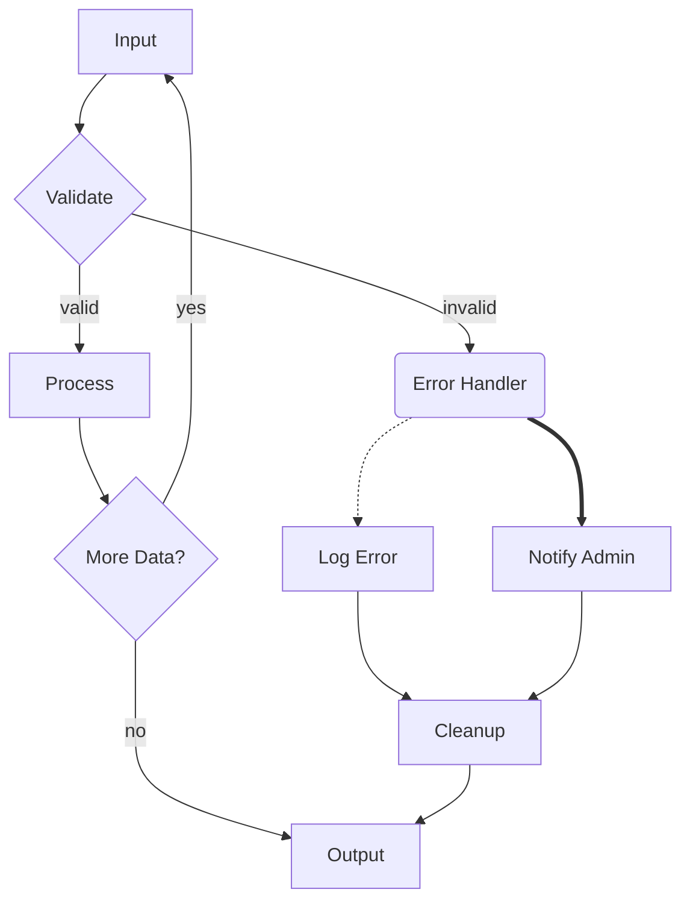

# Edge Routing Deep Dive Research

## Context

We're improving backward edge routing in mmdflux (ASCII diagram renderer for Mermaid flowcharts). Recent changes made backward edges exit from the top of source nodes instead of the right side, but this introduced new visual issues.

## Current State

Running `cargo run -q -- ./tests/fixtures/complex.mmd` produces:

```
                      ┌───────┐
                      │ Input │◄──────────────────────┐
                      └───────┘                       │
                          │                           │
                          │                           │
                          ▼                           │
                    ┌──────────┐                      │
                    < Validate >                      │
                    └──────────┘                      │
                          │                           │
               ┌──valid───invalid┐                    │
               ▼                 ▼                    │
          ┌─────────┐    ╭───────────────╮            │
          │ Process │    │ Error Handler │            │
          └─────────┘    ╰───────────────╯            │
               │                 │                    │
        ┌──────┘         ┌────yes┴──────────┐         │
        ├────────────────▼──────────────────▼─────────┘
 ┌────────────┐    ┌───────────┐    ┌──────────────┐
 < More Data? >    │ Log Error │    │ Notify Admin │
 └────────────┘    └───────────┘    └──────────────┘
        │                │                  │
        │                └┬─────────────────┘
        │                 ▼
        │            ┌─────────┐
        └───────no───│ Cleanup │
                     └─────────┘
                          │
                          │
                          ▼
                     ┌────────┐
                     │ Output │
                     └────────┘
```

Source (`tests/fixtures/complex.mmd`):


---

## Issues to Research

### Issue 1: Missing Arrow (Process → More Data?)

**Problem:** The edge from "Process" to "More Data?" has no arrow (▼) at the entry point. The edge just ends at a junction character (├) without indicating direction.

**Questions:**
- [ ] What does Mermaid.js render for this edge?
- [ ] How does Dagre handle arrow placement when edges merge at junctions?
- [ ] What are we doing now in mmdflux?
- [ ] What's the root cause of the missing arrow?
- [ ] What properties must we achieve? (clear direction indication)
- [ ] What ASCII constraints affect arrow placement at junctions?
- [ ] What tradeoffs exist?

**Research output file:** `issue-1-missing-arrow.md`

---

### Issue 2: "yes" Label Collision

**Problem:** The "yes" label on the backward edge (More Data? → Input) collides with other edges in the line `┌────yes┴──────────┐`. It's unclear which edge the label describes.

**Questions:**
- [ ] How does Mermaid.js position labels on backward/cycle edges?
- [ ] How does Dagre handle label placement to avoid collisions?
- [ ] Where is our label currently being placed (which segment)?
- [ ] Why is it colliding with other edges?
- [ ] What label placement strategies exist for ASCII output?
- [ ] What tradeoffs exist between label clarity and space usage?

**Research output file:** `issue-2-label-collision.md`

---

### Issue 3: Overlapping Edges at Node Top

**Problem:** On "More Data?", the outgoing backward edge (going up to corridor) and the incoming forward edge (from Process) both connect at the top of the node, creating visual confusion.

**Questions:**
- [ ] How does Mermaid.js handle multiple edges connecting to the same side of a node?
- [ ] Does Dagre use different attachment points for incoming vs outgoing edges?
- [ ] What visual separation techniques do SVG renderers use?
- [ ] What are our current attachment point rules?
- [ ] Can ASCII represent multiple connection points on the same node side?
- [ ] What spacing or offset strategies could help?
- [ ] What tradeoffs exist?

**Research output file:** `issue-3-overlapping-edges.md`

---

### Issue 4: Edge Routing Through Nodes

**Problem:** The "no" edge from "More Data?" to "Output" visually passes through or alongside "Cleanup" node (`└───────no───│ Cleanup │`), making the routing confusing.

**Questions:**
- [ ] How does Mermaid.js route edges that skip intermediate nodes?
- [ ] How does Dagre's routing algorithm avoid node overlap?
- [ ] What's happening in our layout that causes this?
- [ ] Is this a layout issue (node positioning) or routing issue (path finding)?
- [ ] What node avoidance strategies work in ASCII grids?
- [ ] What tradeoffs exist between compact layout and clear routing?

**Research output file:** `issue-4-edge-through-node.md`

---

## Reference Materials

### Mermaid.js
- **Repository:** https://github.com/mermaid-js/mermaid
- **Flowchart rendering:** `packages/mermaid/src/diagrams/flowchart/`
- **Edge routing:** Look for dagre integration and edge path calculation
- **Live editor:** https://mermaid.live/ (paste complex.mmd source to see reference output)

### Dagre
- **Repository:** https://github.com/dagrejs/dagre
- **Layout algorithm:** `lib/layout.js`
- **Edge routing:** `lib/position/bk.js` (Brandes-Köpf algorithm)
- **Key concepts:**
  - Rank assignment (vertical positioning)
  - Order (horizontal positioning within rank)
  - Coordinate assignment
  - Edge routing with dummy nodes

### mmdflux Current Implementation
- **Layout:** `src/render/layout.rs` - `compute_layout()`
- **Router:** `src/render/router.rs` - `route_edge()`, `route_backward_edge_vertical()`
- **Edge rendering:** `src/render/edge.rs` - `render_edge()`
- **Recent changes:** Backward edges now exit from TOP of source node (TD layouts)

---

## Research Methodology

For each issue, the research should:

1. **Document Mermaid/Dagre behavior**
   - What does the reference implementation actually do?
   - Why does it work that way?

2. **Document mmdflux current behavior**
   - What code is responsible?
   - What assumptions does it make?

3. **Identify the gap**
   - What's different between reference and our implementation?
   - Is the difference intentional (ASCII constraints) or a bug?

4. **Define requirements**
   - What visual properties must we achieve?
   - What would "correct" look like in ASCII?

5. **Identify constraints**
   - ASCII grid limitations (no curves, limited characters)
   - Monospace font assumptions
   - Performance considerations

6. **Propose solutions**
   - What approaches could work?
   - What are the tradeoffs?
   - Which approach is recommended?

---

## Synthesis

After individual research tasks complete, synthesize findings into:
- `SYNTHESIS.md` - Combined analysis and recommended approach
- Update this tracker with status and key findings

---

## Status

| Issue | Research Status | Key Finding | Proposed Fix |
|-------|----------------|-------------|--------------|
| 1. Missing Arrow | **Complete** | Arrows drawn per-edge before all segments complete; later edge segments overwrite arrow with junction chars via `set_with_connection()` | Draw all arrows in separate pass AFTER all segments (`edge.rs:render_all_edges()`) |
| 2. Label Collision | **Complete** | Label placed on segments[1] (horizontal at source row) instead of segments[2] (isolated corridor). Collision detection doesn't see edge characters. | Place backward edge labels on corridor segment (segments[2]) for clear isolation |
| 3. Overlapping Edges | **Complete** | mmdflux uses fixed center attachment points (`shape.rs:top()`); dagre uses dynamic intersection calculation based on edge approach angle | Short-term: backward edges exit from right side; Long-term: port-based attachment |
| 4. Edge Through Node | **Complete** | Layout issue: no dummy nodes for long edges spanning multiple ranks; routing has no node collision detection | Hybrid: use dagre layout algorithm + add collision detection in router as safety net |

## Synthesis Complete

See `SYNTHESIS.md` for combined analysis, recommended implementation order, and code snippets for each fix.

---

## Direction Change: Full Architecture Over Patches

**Decision Date:** 2026-01-25

After reviewing the proposed fixes, we've determined that incremental patches lead to whack-a-mole. The real solution is implementing the **three missing dagre mechanisms**:

### Missing Mechanisms

| Mechanism | What It Does | Fixes |
|-----------|--------------|-------|
| **Dummy nodes for long edges** | Split multi-rank edges into chains via zero-size nodes | Issues 3, 4 |
| **Edge labels as layout entities** | Labels become dummy nodes with dimensions | Issue 2 |
| **Dynamic intersection calculation** | Compute attachment points from edge approach angles | Issue 3 |

### Research Files

| File | Purpose |
|------|---------|
| `issue-1-missing-arrow.md` | Root cause: render order. Fix is simple and independent. |
| `issue-2-label-collision.md` | Root cause: labels not in layout. Need labels as dummy nodes. |
| `issue-3-overlapping-edges.md` | Root cause: fixed attachment points. Need intersection calc + dummy nodes. |
| `issue-4-edge-through-node.md` | Root cause: no dummy nodes. Need full normalization. |
| `SYNTHESIS.md` | Initial synthesis with patch-based approach (superseded) |
| `DUMMY-NODES-ARCHITECTURE.md` | Detailed plan for dummy node implementation |
| `ARCHITECTURE-VISION.md` | **START HERE** - Full architecture vision with all three mechanisms |

### Research Phase COMPLETE ✓

Research completed 2026-01-25:

1. ✓ **dagre's `lib/normalize.js`** - See `normalize-deep-dive.md`
2. ✓ **dagre's `lib/util.js` `intersectRect`** - See `intersection-deep-dive.md`
3. ✓ **ASCII adaptation** - See `ascii-adaptation.md`
4. ✓ **Label layout integration** - Covered in normalize deep dive

**Next:** Implementation. See `IMPLEMENTATION-PLAN.md` for phased approach.

When ready, use `/plan` to create the implementation plan in `plans/` directory.
