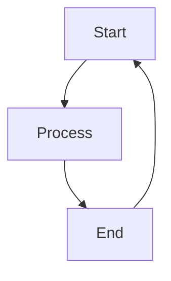
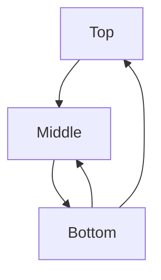

# Backward Edge Overlap Problem: Research Synthesis

**Date**: 2026-01-26
**Issue**: In `simple_cycle.mmd`, the backward edge (End→Start) shares vertical segments with forward edges, causing lost arrows and visual ambiguity.

---

## Executive Summary

The backward edge overlap problem stems from a fundamental difference between how mmdflux and Mermaid/Dagre handle cycle edges. **Mermaid/Dagre reverse the edge direction in the graph during layout**, meaning backward edges are treated as normal forward edges pointing the opposite way. **mmdflux routes backward edges in post-processing**, causing them to share coordinates with existing forward edges.

The fix requires changing either:
1. **When** backward edges are routed (during layout, not after)
2. **Where** backward edges attach (different side or offset position)
3. **How** the routing corridor is structured (separate lanes)

---

## Problem Visualization

### Current mmdflux Output (Buggy)
```
  ┌───────┐
  │ Start │◄──┐
  └───────┘   │
      │       │
      │       │
      ▼       │
 ┌─────────┐  │
 │ Process │  │
 └─────────┘  │
      │       │
      │       │
      ├───────┘     ← Arrow into "End" is LOST
   ┌─────┐          ← Junction character overwrites
   │ End │
   └─────┘
```

### Mermaid Rendering (Reference)
The backward edge exits from the RIGHT side of End, curves down and around, then enters Start from the top-right. No overlap with forward edges.

---

## Root Cause Analysis

### mmdflux Current Implementation

From `router.rs` lines 551-624, `route_backward_edge_vertical()`:

1. **Exit direction**: For TD layouts, backward edges exit from TOP of source node
2. **Attachment point**: Uses `bounds.top()` which returns `(center_x, y)` - the same point forward edges use
3. **Segment creation**: First segment is vertical, connecting to the node's top center

**The collision occurs because:**
- Forward edge Process→End: enters TOP of End at `(center_x, End.y - 1)`
- Backward edge End→Start: exits TOP of End at `(center_x, End.y - 1)`
- Both share the same vertical column down to the End node

### How Mermaid/Dagre Differ

**Key insight from Dagre's `acyclic.js`:**
```javascript
function run(g) {
  // Dagre defaults to DFS-based cycle detection (Mermaid never sets acyclicer)
  var fas = g.graph().acyclicer === 'greedy' ? greedyFAS(g, weightFn(g)) : dfsFAS(g);
  fas.forEach(e => {
    let label = g.edge(e);
    g.removeEdge(e);
    label.reversed = true;
    g.setEdge(e.w, e.v, label, uniqueId('rev'));  // REVERSES THE EDGE
  });
}
```

**Note**: Mermaid uses DFS-based cycle detection (the default), not greedy FAS. The greedy algorithm is available in Dagre but Mermaid never enables it.

Dagre **completely reverses** backward edges in the graph before layout. The layout algorithm then treats End→Start as Start→End for positioning purposes. After layout completes, `reversePointsForReversedEdges()` cosmetically flips the waypoints back.

**Result**: The "backward" edge gets laid out as a normal forward edge in the opposite direction, naturally using different waypoints and corridors than the original forward edges.

---

## ASCII Art Constraints

### Fundamental Limitations

1. **Single character per cell**: Cannot show two overlapping edges
2. **Integer grid**: No sub-pixel positioning
3. **Orthogonal only**: No bezier curves
4. **Junction merging**: When edges cross, a single junction character (`┼`, `├`, etc.) represents both

### Available Characters for Disambiguation

| Scenario | Character | Meaning |
|----------|-----------|---------|
| Two edges crossing | `┼` | Perpendicular intersection |
| Edge meeting node side + continuing | `├` `┤` `┬` `┴` | T-junction |
| Two parallel edges | `│` or `─` | **No distinction possible** |

### Minimum Spacing

- Between parallel edges: 1 cell minimum (to be visually distinct)
- Between edge and node: 1 cell (enforced by `attachment_point()`)
- For N edges on one side: Node width must be ≥ 2N + 2 (borders + positions)

---

## Solution Options

### Solution 1: Side-Differentiation (Recommended for Quick Fix)

**Change**: Backward edges exit from RIGHT side instead of TOP.

```rust
// Current (problematic):
let exit_dir = AttachDirection::Top;

// Fixed:
let exit_dir = AttachDirection::Right;
```

**Visual Result:**
```
  ┌───────┐
  │ Start │◄──┐
  └───────┘   │
      │       │
      ▼       │
 ┌─────────┐  │
 │ Process │  │
 └─────────┘  │
      │       │
      ▼       │
   ┌─────┐    │
   │ End │────┘     ← Exit from RIGHT, no collision
   └─────┘
```

| Aspect | Assessment |
|--------|------------|
| Complexity | LOW (5 lines) |
| Handles multiple edges | Partial (same-side backward edges still collide) |
| Visual clarity | Good (clear distinction forward vs backward) |
| Width impact | None |

### Solution 2: Port-Based Attachment

**Change**: Pre-count edges per node side, distribute attachment points evenly.

```rust
impl NodeBounds {
    pub fn top_port(&self, port: usize, total_ports: usize) -> (usize, usize) {
        let usable_width = self.width.saturating_sub(2);
        let spacing = usable_width / (total_ports + 1);
        let x = self.x + 1 + spacing * (port + 1);
        (x, self.y)
    }
}
```

| Aspect | Assessment |
|--------|------------|
| Complexity | MEDIUM (50-100 lines) |
| Handles multiple edges | Full |
| Visual clarity | High |
| Width impact | May require wider nodes |

### Solution 3: Intersection-Based (Dagre-style)

**Change**: Calculate attachment points based on edge approach angle.

Uses the formula from Dagre's `intersectRect()`:
```rust
fn intersect_rect(bounds: &NodeBounds, approach_point: Point) -> Point {
    // Ray-cast from center to approach point
    // Return intersection with boundary
}
```

| Aspect | Assessment |
|--------|------------|
| Complexity | MEDIUM-HIGH |
| Handles multiple edges | Full (with rounding caveats) |
| Visual clarity | Highest |
| Width impact | None |

### Solution 4: Multi-Lane Corridors

**Change**: Enhance existing lane system to prevent backward edge collisions.

```rust
// Enhanced lane assignment
let lane = assign_lane_avoiding_collisions(&edge, &layout);
let corridor_x = content_width + (lane * corridor_width);
```

| Aspect | Assessment |
|--------|------------|
| Complexity | MEDIUM |
| Handles multiple edges | Full (backward edges only) |
| Visual clarity | Good |
| Width impact | +2 per backward edge |

---

## Comparison Matrix

| Solution | Code Change | Multiple Edges | All Directions | Recommended Phase |
|----------|-------------|----------------|----------------|-------------------|
| 1. Side-Differentiation | ~5 lines | Partial | Yes | **Immediate** |
| 2. Port-Based | ~80 lines | Full | Yes | Phase 2 |
| 3. Intersection | ~50 lines | Full* | Yes | Long-term |
| 4. Multi-Lane | ~30 lines | Backward only | Yes | Phase 2 |

*Rounding may still cause collisions

---

## Recommendation

### Immediate (This Sprint)
Implement **Solution 1 (Side-Differentiation)**:
- Fixes the reported issue in `simple_cycle.mmd`
- Minimal risk, 1-2 hours
- Clear visual improvement

### Short-term (Next Sprint)
Implement **Solution 2 (Port-Based)** or **Solution 4 (Multi-Lane)**:
- Handles general case of multiple edges
- Choose based on whether forward edge collisions are also a concern (Solution 2) or only backward (Solution 4)

### Long-term
Consider **Solution 3 (Intersection-Based)** once the codebase matures:
- Most mathematically principled
- Matches Mermaid.js/Dagre approach
- Requires careful integer rounding handling

---

## Test Cases

### simple_cycle.mmd (Current Issue)

**Expected**: Arrow into End visible, backward edge clearly exits from different location

### multiple_cycles.mmd (Stress Test)

**Expected**: Both backward edges have distinct paths, no arrow loss

---

## Implementation Notes

### For Solution 1 (Side-Differentiation)

File: `src/render/router.rs`
Function: `route_backward_edge_vertical()` (lines 551-624)

Change exit direction mapping:
```rust
// Before
let exit_dir = if diagram_direction == Direction::TopDown {
    AttachDirection::Top
} else {
    AttachDirection::Bottom
};

// After
let exit_dir = AttachDirection::Right;  // For all TD/BT layouts
```

Also update the segment generation to:
1. Exit horizontally from right side
2. Then go vertically to corridor
3. Then horizontally to target right side

### Direction Symmetry

| Layout | Forward Exit/Entry | Backward Exit/Entry (Fixed) |
|--------|-------------------|----------------------------|
| TD | Bottom/Top | Right/Right |
| BT | Top/Bottom | Left/Left |
| LR | Right/Left | Bottom/Bottom |
| RL | Left/Right | Top/Top |

---

## References

- Dagre source: `$HOME/src/dagre/lib/`
- Mermaid source: `$HOME/src/mermaid/packages/mermaid/src/rendering-util/`
- Existing research: `$HOME/src/mmdflux/research/archive/0003-edge-routing-deep-dive/`
- Current router: `$HOME/src/mmdflux/src/render/router.rs`

---

## Appendix: Agent Research Summaries

### Agent 1: mmdflux Implementation Analysis
- Identified exact code paths causing overlap
- Traced segment generation showing same x-coordinate usage
- Documented junction character merging behavior

### Agent 2: Mermaid/Dagre Analysis
- Discovered edge reversal during cycle removal (key insight)
- Documented `reversePointsForReversedEdges()` post-processing
- Explained why Dagre naturally avoids overlap

### Agent 3: ASCII Constraints Analysis
- Confirmed single-character-per-cell limitation
- Documented available junction characters
- Analyzed minimum spacing requirements

### Agent 4: Solution Proposals
- Detailed four solution approaches with code snippets
- Provided ASCII mockups of expected results
- Analyzed trade-offs and direction compatibility
