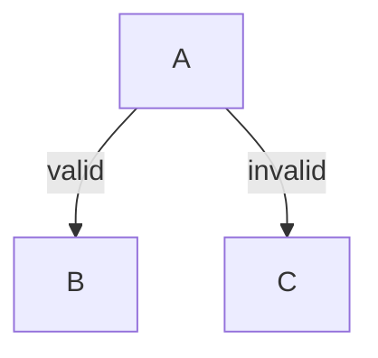

# Edge Label Spacing Research

## Problem Statement

Edge labels in mmdflux render too tight and sometimes overlap the edge path, particularly near corners and arrow segments.

**Minimal reproduction:**


**Current output:**
```
     ┌───┐
     │ A │
     └───┘
      invalid
   valid└──┐
    ▼      ▼
 ┌───┐    ┌───┐
 │ B │    │ C │
 └───┘    └───┘
```

**Problems observed:**
1. "valid" label overlaps the `└──┐` corner segment
2. Labels lack breathing room around them
3. Edge characters get overwritten by label text

## Research Documents

| Document | Description |
|----------|-------------|
| [mermaid-label-positioning.md](./mermaid-label-positioning.md) | How Mermaid.js handles edge labels |
| [dagre-label-options.md](./dagre-label-options.md) | Dagre's label positioning capabilities |
| [mmdflux-current-behavior.md](./mmdflux-current-behavior.md) | Current mmdflux implementation |
| [gap-analysis.md](./gap-analysis.md) | Feature comparison and missing pieces |
| [layout-integration-analysis.md](./layout-integration-analysis.md) | **Key finding:** Existing infrastructure analysis |

## Key Findings

### 1. Infrastructure Already Exists (Partially)

**This is the most important finding.** mmdflux already has infrastructure for layout-time label positioning:

- `Layout` struct has `edge_label_positions: HashMap<(String, String), (usize, usize)>`
- `compute_layout_dagre()` collects edge labels and passes them to dagre
- `dagre::normalize` creates `EdgeLabel` dummy nodes that participate in layout
- `render_all_edges_with_labels()` checks for pre-computed positions first

See [layout-integration-analysis.md](./layout-integration-analysis.md) for the full data flow.

### 2. The Gap: Only Long Edges Get Label Positions

The critical gap is in `dagre/normalize.rs:210-215`:
```rust
// Only normalize edges that span more than 1 rank
if to_rank > from_rank + 1 {
    long_edges.push(...);
}
```

**Short edges (most common case) don't get label dummies**, so they fall back to heuristic rendering, which causes the overlap.

### 3. Secondary Issues

- Coordinate transformation for label positions is incomplete (just rounds dagre coords)
- Non-dagre layout path (`compute_layout()`) has no label support
- Fallback rendering overwrites edge characters

### 4. Dagre's Approach Is Sound

Dagre treats labels as dummy nodes during layout:
- Halves `ranksep` to create vertical space
- Creates label dummy at midpoint rank
- Label participates in crossing reduction and positioning
- Guaranteed non-overlapping placement

This approach is already partially implemented - it just needs to be completed.

## Root Cause Summary

| Issue | Cause |
|-------|-------|
| Short edge labels overlap | No label dummy created (not normalized) |
| Long edge labels may be mispositioned | Coordinate transformation incomplete |
| Fallback rendering overwrites edges | Collision detection doesn't check edge chars |

## Recommended Implementation Strategy

**The fix is to complete the existing system, not build something new.**

### Phase 1: Label Positions for All Edges (Main Fix)

Add label position computation for edges that aren't normalized:

1. In `dagre/position.rs`, after coordinate assignment, compute label positions for all edges
2. For edges without label dummies, calculate midpoint between source and target
3. Apply perpendicular offset (2 chars) to avoid edge path
4. Store in a map that merges with dummy-derived positions

### Phase 2: Fix Coordinate Transformation

Apply proper transformation to label positions (like waypoints get):
- Use `layer_starts` for the primary axis
- Interpolate the secondary axis
- Not just rounding dagre coordinates

### Phase 3: Safety Net in Rendering

Even with good pre-computed positions, add protection:
1. Add `is_edge` flag to `Cell` struct
2. Set flag when drawing edge segments
3. Check flag in collision detection
4. Refuse to overwrite edge cells (shift label instead)

### Phase 4: Support Non-Dagre Layout (Optional)

Extend `compute_layout()` to also compute label positions using similar logic.

## Files to Modify

| File | Phase | Changes |
|------|-------|---------|
| `src/dagre/position.rs` | 1 | Add label position computation for all edges |
| `src/dagre/mod.rs` | 1 | Extract and return label positions for all edges |
| `src/render/layout.rs` | 2 | Fix coordinate transformation for label positions |
| `src/render/canvas.rs` | 3 | Add `is_edge` flag to Cell struct |
| `src/render/edge.rs` | 3 | Mark edge cells, check `is_edge` in collision detection |

## Implementation Complexity

| Phase | Effort | Impact |
|-------|--------|--------|
| Phase 1 | Medium | High - fixes most cases |
| Phase 2 | Low | Medium - fixes coordinate issues |
| Phase 3 | Medium | High - safety net for edge cases |
| Phase 4 | Low | Low - completeness |

**Total estimate:** ~300-400 lines across 5 files.

## Why This Approach

The recommended approach builds on existing infrastructure rather than creating parallel systems:

1. **Leverages Dagre's proven approach** - Label dummies work well for long edges
2. **Fills the gap** - Short edges (most common) get the same treatment
3. **Minimal risk** - Extends existing code paths, doesn't replace them
4. **Testable incrementally** - Each phase can be verified independently

## Related Work

- **Plan 0009:** Arrow direction fix (recently completed) - changed edge routing to use Z-shaped paths
- **research/backward-edge-overlap/:** Previous research on backward edge routing
- **research/edge-routing-deep-dive/:** Detailed edge routing analysis

## Test Cases

After implementing fixes, verify with:
- `tests/fixtures/labeled_edges.mmd` - Multiple labeled edges
- `tests/fixtures/complex.mmd` - Dense diagram with many labels
- Manual test with the reproduction case:
  ```mermaid
  graph TD
      A -->|valid| B
      A -->|invalid| C
  ```

## Next Steps

1. Create implementation plan in `plans/` directory
2. Phase 1 first (main fix for short edge labels)
3. Add integration tests for label positioning
4. Phase 2-3 for robustness
