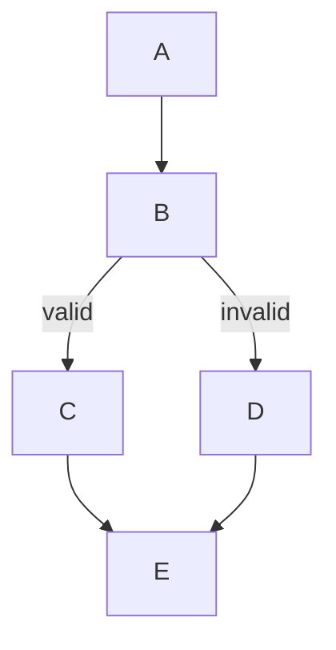

# Ordering Algorithm: Detailed Solution Options

## Context

This document provides detailed implementation approaches for improving mmdflux's ordering algorithm to better match Dagre's behavior. The ordering algorithm determines which nodes appear left vs. right within each layer, directly affecting layout quality.

**Current Problem:** mmdflux's ordering algorithm produces different node arrangements than Dagre, resulting in suboptimal layouts with more edge crossings and confusing visual structure (e.g., main flow on wrong side of diagram).

**Reference Implementation:** `$HOME/src/dagre/lib/order/`

---

## Option A: Add Bias Parameter

### Overview

Add a `bias_right` parameter to the barycenter sorting that affects tie-breaking when nodes have equal barycenters.

### How Bias Affects Tie-Breaking

When two nodes have the same barycenter value, the sort becomes unstable. The bias parameter determines which direction to prefer:

- **Left bias (bias_right = false):** Prefer nodes with smaller original index (tend toward left)
- **Right bias (bias_right = true):** Prefer nodes with larger original index (tend toward right)

This is exactly what Dagre does in `lib/order/sort.js`:

```javascript
function compareWithBias(bias) {
  return (entryV, entryW) => {
    if (entryV.barycenter < entryW.barycenter) return -1;
    if (entryV.barycenter > entryW.barycenter) return 1;
    // Tie-breaking based on bias
    return !bias ? entryV.i - entryW.i : entryW.i - entryV.i;
  };
}
```

### Functions That Need to Change

1. **`reorder_layer()`** - Add `bias_right: bool` parameter
2. **`sweep_down()`** - Pass bias parameter
3. **`sweep_up()`** - Pass bias parameter
4. **`run()`** - Coordinate bias switching

### Code Sketch

```rust
/// Reorder nodes in `free` layer based on barycenter of connections to `fixed` layer.
fn reorder_layer(
    graph: &mut LayoutGraph,
    fixed: &[usize],
    free: &[usize],
    edges: &[(usize, usize)],
    downward: bool,
    bias_right: bool,  // NEW PARAMETER
) {
    // Calculate barycenter for each node in free layer
    let mut barycenters: Vec<(usize, f64, usize)> = Vec::new();

    for (original_pos, &node) in free.iter().enumerate() {
        let neighbors: Vec<usize> = if downward {
            // Looking at predecessors
            edges
                .iter()
                .filter(|&&(_, to)| to == node)
                .map(|&(from, _)| from)
                .filter(|n| fixed.contains(n))
                .collect()
        } else {
            // Looking at successors
            edges
                .iter()
                .filter(|&&(from, _)| from == node)
                .map(|&(_, to)| to)
                .filter(|n| fixed.contains(n))
                .collect()
        };

        let barycenter = if neighbors.is_empty() {
            graph.order[node] as f64
        } else {
            let sum: f64 = neighbors.iter().map(|&n| graph.order[n] as f64).sum();
            sum / neighbors.len() as f64
        };

        barycenters.push((node, barycenter, original_pos));
    }

    // Sort by barycenter with bias-aware tie-breaking
    barycenters.sort_by(|a, b| {
        a.1.partial_cmp(&b.1)
            .unwrap_or(std::cmp::Ordering::Equal)
            .then_with(|| {
                if bias_right {
                    b.2.cmp(&a.2)  // Prefer later positions (right bias)
                } else {
                    a.2.cmp(&b.2)  // Prefer earlier positions (left bias)
                }
            })
    });

    // Update order
    for (new_pos, (node, _, _)) in barycenters.iter().enumerate() {
        graph.order[*node] = new_pos;
    }
}

fn sweep_down(
    graph: &mut LayoutGraph,
    layers: &[Vec<usize>],
    edges: &[(usize, usize)],
    bias_right: bool,  // NEW
) {
    for i in 1..layers.len() {
        let fixed = &layers[i - 1];
        let free = &layers[i];
        reorder_layer(graph, fixed, free, edges, true, bias_right);
    }
}

fn sweep_up(
    graph: &mut LayoutGraph,
    layers: &[Vec<usize>],
    edges: &[(usize, usize)],
    bias_right: bool,  // NEW
) {
    for i in (0..layers.len() - 1).rev() {
        let fixed = &layers[i + 1];
        let free = &layers[i];
        reorder_layer(graph, fixed, free, edges, false, bias_right);
    }
}
```

### Complexity

- **Lines of code:** ~20-30 changes
- **Testing needed:**
  - Unit tests for bias behavior
  - Verify existing tests still pass
  - Add test comparing left vs right bias outcomes
- **Risk:** Low - minimal changes, backwards compatible

### What Could Go Wrong

- If bias is always one direction, layouts may be consistently shifted left/right
- Without multiple attempts (Option B), a single bias may not find optimal
- Tests may need updating if expected orders change

---

## Option B: Multiple Ordering Attempts

### Overview

Run the ordering algorithm multiple times with different configurations, keeping the result with the fewest edge crossings. This matches Dagre's approach of trying 4 different bias configurations.

### How to Save/Restore Ordering State

The ordering state is stored in `graph.order: Vec<usize>`. We can save/restore by cloning:

```rust
// Save state
let saved_order = graph.order.clone();

// Restore state
graph.order = saved_order;
```

### How Dagre Runs Multiple Attempts

From `lib/order/index.js`:

```javascript
for (let i = 0, lastBest = 0; lastBest < 4; ++i, ++lastBest) {
    sweepLayerGraphs(
        i % 2 ? downLayerGraphs : upLayerGraphs,
        i % 4 >= 2,  // biasRight: true for iterations 2,3
    );

    layering = util.buildLayerMatrix(g);
    let cc = crossCount(g, layering);
    if (cc < bestCC) {
        lastBest = 0;  // Reset counter on improvement
        best = Object.assign({}, layering);
        bestCC = cc;
    }
}
```

Key pattern:
- Iteration 0: down sweep, left bias
- Iteration 1: up sweep, left bias
- Iteration 2: down sweep, right bias
- Iteration 3: up sweep, right bias
- Continues until 4 iterations without improvement

### How to Compare Orderings

Use crossing count between adjacent layers:

```rust
fn count_all_crossings(
    graph: &LayoutGraph,
    layers: &[Vec<usize>],
    edges: &[(usize, usize)],
) -> usize {
    let mut total = 0;
    for i in 0..layers.len().saturating_sub(1) {
        total += count_crossings_between(graph, &layers[i], &layers[i + 1], edges);
    }
    total
}
```

This function already exists in `order.rs`.

### When to Stop Iterating

Two options:

**Option B1: Fixed 4 configurations (simpler)**
```rust
// Always try exactly 4 configurations
for config in [(false, false), (true, false), (false, true), (true, true)] {
    let (down_first, bias_right) = config;
    // ...
}
```

**Option B2: Dagre-style adaptive (more complex)**
```rust
// Continue until 4 iterations without improvement
let mut last_best = 0;
let mut i = 0;
while last_best < 4 {
    // Try configuration based on iteration
    let down_first = i % 2 == 0;
    let bias_right = (i % 4) >= 2;
    // ...
    if crossings < best_crossings {
        last_best = 0;
    }
    last_best += 1;
    i += 1;
}
```

### Code Sketch (Option B1 - Simpler)

```rust
pub fn run(graph: &mut LayoutGraph) {
    let layers = rank::by_rank(graph);
    if layers.len() < 2 {
        return;
    }

    // Initialize order based on current layer positions
    for layer in &layers {
        for (idx, &node) in layer.iter().enumerate() {
            graph.order[node] = idx;
        }
    }

    let edges = graph.effective_edges();
    let initial_order = graph.order.clone();

    let mut best_order = graph.order.clone();
    let mut best_crossings = count_all_crossings(graph, &layers, &edges);

    // Try different bias configurations
    let configs = [
        (true, false),   // down sweep, left bias
        (false, false),  // up sweep, left bias
        (true, true),    // down sweep, right bias
        (false, true),   // up sweep, right bias
    ];

    for &(down_first, bias_right) in &configs {
        // Reset to initial order
        graph.order = initial_order.clone();

        // Run sweeps with this configuration
        for _ in 0..MAX_ITERATIONS {
            let prev_crossings = count_all_crossings(graph, &layers, &edges);

            if down_first {
                sweep_down(graph, &layers, &edges, bias_right);
                sweep_up(graph, &layers, &edges, bias_right);
            } else {
                sweep_up(graph, &layers, &edges, bias_right);
                sweep_down(graph, &layers, &edges, bias_right);
            }

            let crossings = count_all_crossings(graph, &layers, &edges);
            if crossings >= prev_crossings {
                break;
            }
        }

        // Check if this is the best so far
        let crossings = count_all_crossings(graph, &layers, &edges);
        if crossings < best_crossings {
            best_crossings = crossings;
            best_order = graph.order.clone();
        }
    }

    graph.order = best_order;
}
```

### Code Sketch (Option B2 - Dagre-style)

```rust
pub fn run(graph: &mut LayoutGraph) {
    let layers = rank::by_rank(graph);
    if layers.len() < 2 {
        return;
    }

    // Initialize order
    for layer in &layers {
        for (idx, &node) in layer.iter().enumerate() {
            graph.order[node] = idx;
        }
    }

    let edges = graph.effective_edges();

    let mut best_order = graph.order.clone();
    let mut best_crossings = count_all_crossings(graph, &layers, &edges);

    let mut i = 0;
    let mut last_best = 0;

    while last_best < 4 {
        // Alternate sweep direction and bias
        let down_first = i % 2 == 0;
        let bias_right = (i % 4) >= 2;

        // Single sweep iteration
        if down_first {
            sweep_down(graph, &layers, &edges, bias_right);
        } else {
            sweep_up(graph, &layers, &edges, bias_right);
        }

        let crossings = count_all_crossings(graph, &layers, &edges);

        if crossings < best_crossings {
            last_best = 0;
            best_crossings = crossings;
            best_order = graph.order.clone();
        } else {
            last_best += 1;
        }

        i += 1;
    }

    graph.order = best_order;
}
```

### Complexity

- **Lines of code:** ~50-70
- **Testing needed:**
  - Verify best ordering is selected
  - Test with graphs that have clear optimal orderings
  - Performance tests (multiple iterations)
- **Risk:** Low-Medium - more computation, but predictable

### What Could Go Wrong

- Performance: 4x more iterations than current
- May still not find global optimum (local minima)
- Order of configurations might matter

---

## Option C: Improved Initial Ordering

### Overview

Instead of using arbitrary insertion order, compute an initial ordering based on graph structure that provides a better starting point for crossing minimization.

### What Makes a Good Initial Order

A good initial order should:
1. Keep connected components together
2. Respect edge directions (sources before sinks when reading left-to-right)
3. Minimize initial crossings
4. Be deterministic

### How Dagre's initOrder Works

From `lib/order/init-order.js`:

```javascript
function initOrder(g) {
  let visited = {};
  let layers = util.range(maxRank + 1).map(() => []);

  function dfs(v) {
    if (visited[v]) return;
    visited[v] = true;
    let node = g.node(v);
    layers[node.rank].push(v);  // Add to layer in DFS order
    g.successors(v).forEach(dfs);
  }

  // Start DFS from nodes sorted by rank (top-down)
  let orderedVs = simpleNodes.sort((a, b) => g.node(a).rank - g.node(b).rank);
  orderedVs.forEach(dfs);

  return layers;
}
```

Key insight: **DFS traversal from top-rank nodes**
- Nodes are added to their layer in DFS visit order
- This naturally groups connected nodes together
- Starting from sorted source nodes ensures top-down flow

### Options for Initial Ordering

**Option C1: DFS Order (matches Dagre)**
```rust
fn init_order_dfs(graph: &LayoutGraph, layers: &mut [Vec<usize>]) {
    let edges = graph.effective_edges();
    let mut visited = vec![false; graph.node_ids.len()];

    // Build successor list
    let mut successors: Vec<Vec<usize>> = vec![Vec::new(); graph.node_ids.len()];
    for &(from, to) in &edges {
        successors[from].push(to);
    }

    // Clear existing layers
    for layer in layers.iter_mut() {
        layer.clear();
    }

    // DFS from nodes sorted by rank
    let mut nodes_by_rank: Vec<usize> = (0..graph.node_ids.len()).collect();
    nodes_by_rank.sort_by_key(|&n| graph.ranks[n]);

    fn dfs(
        node: usize,
        graph: &LayoutGraph,
        visited: &mut [bool],
        successors: &[Vec<usize>],
        layers: &mut [Vec<usize>],
    ) {
        if visited[node] {
            return;
        }
        visited[node] = true;
        layers[graph.ranks[node] as usize].push(node);

        for &succ in &successors[node] {
            dfs(succ, graph, visited, successors, layers);
        }
    }

    for node in nodes_by_rank {
        dfs(node, graph, &mut visited, &successors, layers);
    }

    // Update order indices
    for layer in layers.iter() {
        for (idx, &node) in layer.iter().enumerate() {
            // Note: graph is borrowed, need different approach
        }
    }
}
```

**Option C2: BFS Order**
```rust
fn init_order_bfs(graph: &LayoutGraph, layers: &mut [Vec<usize>]) {
    let edges = graph.effective_edges();
    let mut visited = vec![false; graph.node_ids.len()];
    let mut queue = VecDeque::new();

    // Build successor list
    let mut successors: Vec<Vec<usize>> = vec![Vec::new(); graph.node_ids.len()];
    for &(from, to) in &edges {
        successors[from].push(to);
    }

    // Clear layers
    for layer in layers.iter_mut() {
        layer.clear();
    }

    // Find source nodes (no predecessors)
    let mut in_degree = vec![0usize; graph.node_ids.len()];
    for &(_, to) in &edges {
        in_degree[to] += 1;
    }

    // Start BFS from sources
    for (node, &deg) in in_degree.iter().enumerate() {
        if deg == 0 {
            queue.push_back(node);
        }
    }

    while let Some(node) = queue.pop_front() {
        if visited[node] {
            continue;
        }
        visited[node] = true;
        layers[graph.ranks[node] as usize].push(node);

        for &succ in &successors[node] {
            if !visited[succ] {
                queue.push_back(succ);
            }
        }
    }
}
```

**Option C3: Connectivity-Based (keep subtrees together)**

This approach groups nodes that share the same parent together:

```rust
fn init_order_connectivity(graph: &LayoutGraph, layers: &mut [Vec<usize>]) {
    let edges = graph.effective_edges();

    // For each layer, sort nodes by their primary predecessor's position
    for rank in 1..layers.len() {
        let prev_layer = &layers[rank - 1];
        let current_layer = &mut layers[rank];

        // Create position lookup for previous layer
        let prev_pos: HashMap<usize, usize> = prev_layer
            .iter()
            .enumerate()
            .map(|(pos, &node)| (node, pos))
            .collect();

        // Sort current layer by predecessor position
        current_layer.sort_by_key(|&node| {
            // Find predecessors in previous layer
            let preds: Vec<usize> = edges
                .iter()
                .filter(|&&(_, to)| to == node)
                .map(|&(from, _)| from)
                .filter(|n| prev_pos.contains_key(n))
                .collect();

            if preds.is_empty() {
                usize::MAX  // No predecessors, put at end
            } else {
                // Use minimum predecessor position
                preds.iter().filter_map(|p| prev_pos.get(p)).min().copied().unwrap_or(usize::MAX)
            }
        });
    }
}
```

### Code Sketch (DFS - Recommended)

```rust
fn init_order(graph: &mut LayoutGraph, layers: &[Vec<usize>]) {
    let edges = graph.effective_edges();
    let n = graph.node_ids.len();

    let mut visited = vec![false; n];

    // Build successor adjacency
    let mut successors: Vec<Vec<usize>> = vec![Vec::new(); n];
    for &(from, to) in &edges {
        successors[from].push(to);
    }

    // Track order within each layer
    let mut layer_indices: Vec<usize> = vec![0; layers.len()];

    // Get nodes sorted by rank for DFS start order
    let mut start_nodes: Vec<usize> = (0..n).collect();
    start_nodes.sort_by_key(|&node| graph.ranks[node]);

    fn dfs(
        node: usize,
        graph: &mut LayoutGraph,
        visited: &mut [bool],
        successors: &[Vec<usize>],
        layer_indices: &mut [usize],
    ) {
        if visited[node] {
            return;
        }
        visited[node] = true;

        let rank = graph.ranks[node] as usize;
        graph.order[node] = layer_indices[rank];
        layer_indices[rank] += 1;

        for &succ in &successors[node] {
            dfs(succ, graph, visited, successors, layer_indices);
        }
    }

    for node in start_nodes {
        dfs(node, graph, &mut visited, &successors, &mut layer_indices);
    }
}

pub fn run(graph: &mut LayoutGraph) {
    let layers = rank::by_rank(graph);
    if layers.len() < 2 {
        return;
    }

    // Use DFS-based initial ordering instead of arbitrary
    init_order(graph, &layers);

    let edges = graph.effective_edges();
    let mut best_crossings = count_all_crossings(graph, &layers, &edges);

    for _ in 0..MAX_ITERATIONS {
        let prev_crossings = best_crossings;

        sweep_down(graph, &layers, &edges, false);
        sweep_up(graph, &layers, &edges, false);

        best_crossings = count_all_crossings(graph, &layers, &edges);

        if best_crossings >= prev_crossings {
            break;
        }
    }
}
```

### Complexity

- **Lines of code:** ~60-80
- **Testing needed:**
  - Verify DFS produces expected order
  - Test with various graph structures
  - Compare against current arbitrary order
- **Risk:** Medium - changes fundamental starting point

### What Could Go Wrong

- DFS order might not always be better (depends on graph structure)
- Edge case handling (disconnected components, cycles)
- May need to handle the layers vector differently (rebuild vs. modify)

---

## Option D: Other Approaches

### D1: Edge Weights

Dagre uses edge weights in both barycenter calculation and crossing counting:

```javascript
// In barycenter.js
let result = inV.reduce((acc, e) => {
    let edge = g.edge(e),
        nodeU = g.node(e.v);
    return {
        sum: acc.sum + (edge.weight * nodeU.order),
        weight: acc.weight + edge.weight
    };
}, { sum: 0, weight: 0 });
```

**Implementation:**
- Add weight field to edges
- Modify barycenter calculation to use weights
- Long edges get weight=1 by default
- Edges with labels could get higher weight

**Complexity:** ~40 lines
**Risk:** Medium - affects barycenter fundamentally

### D2: Different Sweep Patterns

Dagre alternates between down and up sweeps in a specific pattern. Current mmdflux always does down-then-up.

**Options:**
- Up-then-down on odd iterations
- Single-direction sweeps per iteration
- Adaptive based on improvement

**Implementation:**
```rust
for i in 0..MAX_ITERATIONS {
    if i % 2 == 0 {
        sweep_down(graph, &layers, &edges, bias);
        sweep_up(graph, &layers, &edges, bias);
    } else {
        sweep_up(graph, &layers, &edges, bias);
        sweep_down(graph, &layers, &edges, bias);
    }
}
```

**Complexity:** ~10 lines
**Risk:** Low

### D3: Hybrid: A + B + C Combined

Combine all improvements for maximum Dagre parity:

1. DFS initial order (Option C)
2. Add bias parameter (Option A)
3. Multiple configurations with best selection (Option B)

```rust
pub fn run(graph: &mut LayoutGraph) {
    let layers = rank::by_rank(graph);
    if layers.len() < 2 {
        return;
    }

    // Phase 1: DFS-based initial ordering
    init_order(graph, &layers);

    let edges = graph.effective_edges();
    let initial_order = graph.order.clone();

    let mut best_order = graph.order.clone();
    let mut best_crossings = count_all_crossings(graph, &layers, &edges);

    // Phase 2: Try multiple bias configurations
    let mut i = 0;
    let mut last_best = 0;

    while last_best < 4 {
        let down_first = i % 2 == 0;
        let bias_right = (i % 4) >= 2;

        // Reset to initial for each configuration
        if i > 0 && i % 4 == 0 {
            graph.order = initial_order.clone();
        }

        // Single sweep with bias
        if down_first {
            sweep_down(graph, &layers, &edges, bias_right);
        } else {
            sweep_up(graph, &layers, &edges, bias_right);
        }

        let crossings = count_all_crossings(graph, &layers, &edges);

        if crossings < best_crossings {
            last_best = 0;
            best_crossings = crossings;
            best_order = graph.order.clone();
        } else {
            last_best += 1;
        }

        i += 1;
    }

    graph.order = best_order;
}
```

**Complexity:** ~100-120 lines total
**Risk:** Medium - most changes but most Dagre-aligned

---

## Comparison Matrix

| Option | Lines of Code | Testing Complexity | Risk Level | Expected Impact | Matches Dagre? |
|--------|--------------|-------------------|------------|-----------------|----------------|
| **A: Bias Parameter** | 20-30 | Low | Low | Medium | Partial |
| **B: Multiple Attempts** | 50-70 | Medium | Low-Medium | High | Mostly |
| **C: DFS Initial Order** | 60-80 | Medium | Medium | Medium-High | Yes |
| **D1: Edge Weights** | 40 | Medium | Medium | Medium | Yes |
| **D2: Sweep Patterns** | 10 | Low | Low | Low | Partial |
| **D3: Hybrid (A+B+C)** | 100-120 | High | Medium | Very High | Yes |

### Scoring (1-5, higher is better)

| Option | Effort | Value | Risk (inverted) | Dagre Parity | Total |
|--------|--------|-------|-----------------|--------------|-------|
| A | 5 | 3 | 5 | 2 | 15 |
| B | 4 | 4 | 4 | 4 | 16 |
| C | 3 | 4 | 3 | 5 | 15 |
| A+B | 3 | 5 | 4 | 4 | 16 |
| D3 (A+B+C) | 2 | 5 | 3 | 5 | 15 |

---

## Recommendation

### Recommended Implementation Order

**Phase 1: Option A (Bias Parameter)**
- Lowest risk, foundational change
- Required for Option B anyway
- Can be tested independently
- ~30 minutes to implement

**Phase 2: Option B (Multiple Attempts)**
- Builds on Option A
- Highest expected impact for moderate effort
- Matches Dagre's core algorithm structure
- ~1-2 hours to implement

**Phase 3 (Optional): Option C (DFS Initial Order)**
- Further refinement if A+B insufficient
- Can be added independently after A+B
- ~1 hour to implement

### Why This Order?

1. **A+B together gives ~80% of Dagre's ordering behavior** with minimal risk
2. A is required infrastructure for B
3. C is orthogonal and can be added later if needed
4. D1 (edge weights) is complex and may not be necessary
5. D2 (sweep patterns) is minimal impact

### Expected Outcome

After implementing A+B:
- Node orderings should match Dagre in most cases
- Main flow paths should stay together (left side in TD)
- Error/alternate paths should stay together (right side in TD)
- Edge crossings should be minimized

### Metrics for Success

1. `complex.mmd` renders with same left/right arrangement as Mermaid
2. Total edge crossings reduced compared to current
3. All existing tests still pass
4. No performance regression (< 2x slower)

---

## Test Cases to Validate

### Test 1: Simple Branch

- B and C should be consistently ordered
- No crossings expected

### Test 2: Main Flow vs. Error Branch

- C should consistently be on one side
- D should consistently be on other side

### Test 3: Complex (existing fixture)
- Main flow nodes on left
- Error handling on right
- Backward edge routing improves

---

## References

- Dagre source: `$HOME/src/dagre/lib/order/`
- Current mmdflux: `$HOME/src/mmdflux/src/dagre/order.rs`
- Initial analysis: `00-initial-analysis.md`
- Dagre edge routing: `../0006-edge-routing-horizontal-offset/02-dagre-edge-routing.md`
