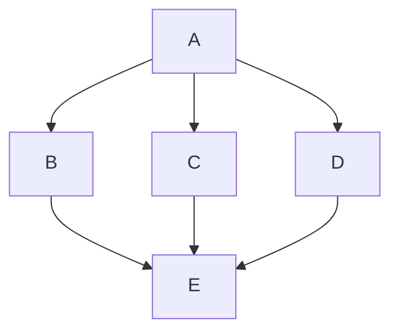

# Ordering Algorithm Research: Synthesis

## Executive Summary

After implementing Brandes-Kopf (Plan 0011), `complex.mmd` still renders differently from Mermaid/Dagre. This research confirms the root cause is **node ordering within layers**, not coordinate assignment.

**The gap:** mmdflux's ordering algorithm always uses left-bias tie-breaking and never explores alternative orderings. Dagre uses a bias parameter that alternates between left and right, trying multiple configurations to find the arrangement with the fewest edge crossings.

**Recommended fix:** Implement A + B2 + C (bias parameter + Dagre-style adaptive loop + DFS initial ordering) for maximum Dagre parity.

---

## Summary of the Gap

### What Dagre Does

From `01-dagre-ordering-analysis.md`:

1. **DFS-based initial ordering** - Naturally groups connected nodes together
2. **Bias parameter** - Alternates between left-bias and right-bias tie-breaking
3. **Multiple configurations** - Tries 4 different patterns: down/left, up/left, down/right, up/right
4. **Best-tracking** - Saves the ordering with fewest crossings across all attempts
5. **Termination** - Continues until 4 iterations without improvement

Key code from Dagre (`lib/order/index.js`):
```javascript
for (let i = 0, lastBest = 0; lastBest < 4; ++i, ++lastBest) {
    sweepLayerGraphs(
        i % 2 ? downLayerGraphs : upLayerGraphs,
        i % 4 >= 2,  // biasRight: true for iterations 2,3
    );
    let cc = crossCount(g, layering);
    if (cc < bestCC) {
        lastBest = 0;
        best = Object.assign({}, layering);
        bestCC = cc;
    }
}
```

### What mmdflux Does

From `02-mmdflux-ordering-analysis.md`:

1. **Arbitrary initial ordering** - Uses parse/insertion order
2. **No bias parameter** - Always prefers earlier (left) positions for ties
3. **Single configuration** - Runs the same algorithm repeatedly
4. **No best-tracking** - May end with worse order than intermediate states
5. **Immediate termination** - Stops when a full sweep produces no improvement

Key code from mmdflux (`src/dagre/order.rs:104-109`):
```rust
barycenters.sort_by(|a, b| {
    a.1.partial_cmp(&b.1)
        .unwrap_or(std::cmp::Ordering::Equal)
        .then_with(|| a.2.cmp(&b.2))  // ALWAYS left-bias
});
```

### The Impact

When nodes have equal barycenters (common in branching diagrams):
- **Dagre:** Tries both left and right placements, keeps the better one
- **mmdflux:** Always places them in the same relative order (left-bias)

This causes mmdflux to get stuck in local minima that Dagre escapes, resulting in:
- Main flow appearing on the wrong side of the diagram
- More edge crossings
- Less intuitive visual structure

---

## Recommended Approach

### Implementation: A + B2 + C (Maximum Dagre Parity)

**Option A: Add Bias Parameter** (~20-30 lines)
- Add `bias_right: bool` parameter to `reorder_layer()`
- Change tie-breaking direction based on bias
- Foundational for the adaptive loop

**Option B2: Dagre-Style Adaptive Loop** (~50-70 lines)
- Each iteration does ONE sweep (not paired down+up), alternating direction via `i % 2`
- Bias pattern: `i % 4 >= 2` gives false, false, true, true (repeating)
- Tracks best ordering across all iterations
- Terminates after 4 consecutive non-improving iterations (`lastBest < 4`)
- Saves ordering when equal crossings too (matches Dagre's `structuredClone` on `cc === bestCC`)

**Option C: DFS Initial Ordering** (~40-60 lines)
- Replace arbitrary insertion-order initialization with DFS from top-ranked nodes
- Groups connected nodes together naturally
- Matches Dagre's `initOrder()` function exactly

### Why Maximum Parity

The Dagre loop structure is specific and well-tested. Key differences from B1:
- **Single sweep per iteration** (not paired): Dagre does `i % 2 ? down : up`, one direction per iteration
- **Adaptive termination**: Continues as long as improvements are found, stops after 4 failures
- **Equal-crossing preservation**: When `cc === bestCC`, Dagre saves the new ordering (may have better structural properties even with same crossing count)
- **DFS init**: Dagre's starting point matters; arbitrary order requires more iterations to converge

---

## Implementation Plan Outline

### Phase 1: Add Bias Parameter (Option A)

**Changes to `src/dagre/order.rs`:**

1. Modify `reorder_layer()` signature to accept `bias_right: bool`
2. Update tie-breaking: `if bias_right { b.2.cmp(&a.2) } else { a.2.cmp(&b.2) }`
3. Update `sweep_down()` and `sweep_up()` signatures to pass bias

### Phase 2: DFS Initial Ordering (Option C)

**Add to `src/dagre/order.rs`:**

```rust
fn init_order(graph: &mut LayoutGraph, layers: &mut [Vec<usize>]) {
    let edges = graph.effective_edges();
    let mut visited = vec![false; graph.node_ids.len()];
    let mut successors: Vec<Vec<usize>> = vec![Vec::new(); graph.node_ids.len()];
    for &(from, to) in &edges {
        successors[from].push(to);
    }
    // Clear layers
    for layer in layers.iter_mut() { layer.clear(); }
    // DFS from nodes sorted by rank (ascending)
    let mut start_nodes: Vec<usize> = (0..graph.node_ids.len()).collect();
    start_nodes.sort_by_key(|&n| graph.ranks[n]);
    for node in start_nodes {
        dfs(node, graph, &mut visited, &successors, layers);
    }
    // Set order from layer positions
    for layer in layers.iter() {
        for (idx, &node) in layer.iter().enumerate() {
            graph.order[node] = idx;
        }
    }
}
```

### Phase 3: Dagre-Style Adaptive Loop (Option B2)

**Rewrite `run()` to match Dagre's `order()` exactly:**

```rust
pub fn run(graph: &mut LayoutGraph) {
    let mut layers = rank::by_rank(graph);
    if layers.len() < 2 { return; }
    let edges = graph.effective_edges();

    // DFS-based initial ordering (Phase 2)
    init_order(graph, &mut layers);

    let mut best_cc = usize::MAX;
    let mut best_order = graph.order.clone();

    // Dagre-style adaptive loop:
    // - Each iteration does ONE sweep (alternating up/down via i % 2)
    // - Bias alternates: i % 4 >= 2 gives false, false, true, true
    // - Terminates after 4 consecutive non-improving iterations
    let mut i = 0usize;
    let mut last_best = 0usize;

    while last_best < 4 {
        let bias_right = (i % 4) >= 2;
        if i % 2 == 1 {
            sweep_down(graph, &layers, &edges, bias_right);
        } else {
            sweep_up(graph, &layers, &edges, bias_right);
        }

        let cc = count_all_crossings(graph, &layers, &edges);
        if cc < best_cc {
            last_best = 0;
            best_cc = cc;
            best_order = graph.order.clone();
        } else if cc == best_cc {
            best_order = graph.order.clone();
        } else {
            last_best += 1;
        }

        i += 1;
        last_best += 1; // incremented each iteration per Dagre's ++lastBest
    }

    graph.order = best_order;
}
```

Note: The `last_best` logic needs care. In Dagre, `lastBest` increments every iteration (`++lastBest` in the for-loop), but resets to 0 on improvement. So the counter tracks consecutive non-improving iterations.

---

## Files That Would Change

| File | Changes | Phase |
|------|---------|-------|
| `src/dagre/order.rs` | Add bias parameter to sweep/reorder functions | 1 |
| `src/dagre/order.rs` | Add `init_order()` DFS function | 2 |
| `src/dagre/order.rs` | Rewrite `run()` with Dagre-style adaptive loop | 3 |

No changes needed to:
- `src/dagre/mod.rs` - Pipeline orchestration unchanged
- `src/dagre/rank.rs` - Rank assignment unchanged
- `src/dagre/bk.rs` - Brandes-Kopf unchanged (runs after ordering)
- Test files - Existing tests should still pass (may need updates if expected orders change)

---

## Success Criteria

1. **`complex.mmd`** renders with main flow on left, error handling on right (matching Mermaid)
2. **Edge crossings** reduced in test cases with branching structures
3. **All existing tests** pass (or are updated with new expected values)
4. **Performance** - No more than 2x slower (acceptable since we try 4x configurations)

---

## Test Cases for Validation

### Existing Fixture: `complex.mmd`
- Before: Error Handler left, Process right
- After: Process left, Error Handler right (matching Mermaid)

### New Test: Branch Ordering

Should produce consistent, low-crossing order.

### New Test: Triple Branch

Verify all three paths are ordered consistently.

---

## References

- `00-initial-analysis.md` - Original gap analysis
- `01-dagre-ordering-analysis.md` - Dagre's ordering algorithm details
- `02-mmdflux-ordering-analysis.md` - Current mmdflux implementation analysis
- `03-solution-options.md` - Detailed solution options with code sketches
- Dagre source: `$HOME/src/dagre/lib/order/`
- mmdflux source: `$HOME/src/mmdflux/src/dagre/order.rs`

---

## Next Steps

1. Create implementation plan (using `/plan` workflow)
2. Implement Phase 1 (bias parameter)
3. Implement Phase 2 (DFS initial ordering)
4. Implement Phase 3 (Dagre-style adaptive loop)
5. Test with `complex.mmd` and other fixtures
6. Verify maximum Dagre parity achieved
