# Q1: What Overlap Cases Still Exist After Stagger Preservation?

## Summary

Several fixtures still exhibit edge overlap after stagger preservation. The most common pattern is **forward-forward same-face overlap** where multiple edges arrive at the same node's top face with arrows occupying adjacent or identical cells (e.g., `▼ ▼` or `▼▼`). True single-cell overlap (`▼▼` in one cell) appears in `double_skip.mmd` and `stacked_fan_in.mmd`. Near-overlaps where arrows land in adjacent cells but edges share vertical trunk segments appear in `five_fan_in.mmd`, `narrow_fan_in.mmd`, and `fan_in.mmd`. The `fan_in_lr.mmd` fixture has a rendering defect where edges appear garbled. No backward-backward overlaps were found.

## Where

Fixtures rendered via `cargo run -q -- tests/fixtures/<name>.mmd`:
- `double_skip.mmd` (TD)
- `skip_edge_collision.mmd` (TD)
- `stacked_fan_in.mmd` (TD)
- `multiple_cycles.mmd` (TD)
- `fan_in.mmd` (TD)
- `fan_out.mmd` (TD)
- `five_fan_in.mmd` (TD)
- `narrow_fan_in.mmd` (TD)
- `diamond_fan.mmd` (TD)
- `complex.mmd` (TD)
- `ci_pipeline.mmd` (LR)
- `fan_in_lr.mmd` (LR) - bonus
- `simple_cycle.mmd` (TD) - bonus

## What

### 1. `double_skip.mmd` (TD) -- OVERLAP FOUND

**Source:**
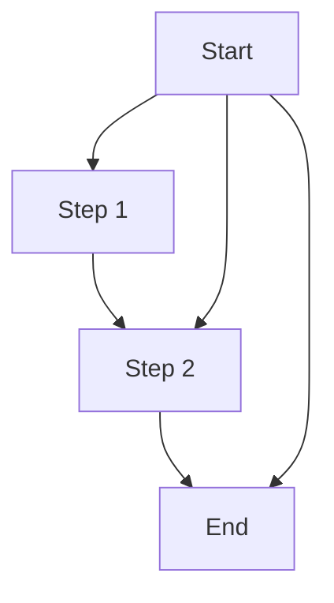

**Rendered output:**
```
      ┌───────┐
      │ Start │
      └───────┘
         │  └──┐
      ┌──┘     │
      ▼        │
┌────────┐     │
│ Step 1 │     │
└────────┘─────┤
      │  │     │
      └┐ │     │
       ▼ ▼     │
  ┌────────┐   │
  │ Step 2 │   │
  └────────┘───┘
        │ │
        └┐│
         ▼▼
      ┌─────┐
      │ End │
      └─────┘
```

**Overlaps found:**
1. **`▼ ▼` at Step 2 top face** (row with `▼ ▼`): Two forward edges arrive at Step 2's top -- `B-->C` (direct) and `A-->C` (skip edge). The arrows are in adjacent cells but distinct. This is a **forward-forward same-face** near-overlap.
2. **`▼▼` at End top face** (row with `▼▼`): Two forward edges arrive at End's top -- `C-->D` (direct) and `A-->D` (skip edge). The arrows are in immediately adjacent cells with no gap between them. This is a **forward-forward same-face** overlap -- the two arrows are jammed together with zero spacing.

---

### 2. `skip_edge_collision.mmd` (TD) -- OVERLAP FOUND

**Source:**
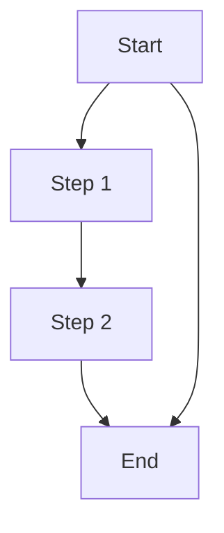

**Rendered output:**
```
    ┌───────┐
    │ Start │
    └───────┘
       │ └─┐
      ┌┘   │
      ▼    │
┌────────┐ │
│ Step 1 │ │
└────────┘ │
     │     │
     │     │
     ▼     │
┌────────┐ │
│ Step 2 │ │
└────────┘─┘
      │  │
      └┐ │
       ▼ ▼
     ┌─────┐
     │ End │
     └─────┘
```

**Overlaps found:**
1. **`▼ ▼` at End top face**: Two forward edges arrive at End -- `C-->D` (direct) and `A-->D` (skip edge). Arrows are in adjacent cells with one space gap. This is a **forward-forward same-face** near-overlap. Less severe than `double_skip` because there is a space between the arrows.

---

### 3. `stacked_fan_in.mmd` (TD) -- OVERLAP FOUND

**Source:**
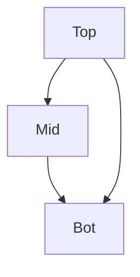

**Rendered output:**
```
   ┌─────┐
   │ Top │
   └─────┘
     │ └┐
    ┌┘  │
    ▼   │
┌─────┐ │
│ Mid │ │
└─────┘─┘
    │ │
    └┐│
     ▼▼
   ┌─────┐
   │ Bot │
   └─────┘
```

**Overlaps found:**
1. **`▼▼` at Bot top face**: Two forward edges arrive at Bot -- `B-->C` (direct) and `A-->C` (skip edge). The arrows occupy adjacent cells with zero spacing. This is a **forward-forward same-face** overlap -- identical to the `double_skip` End node pattern.

---

### 4. `multiple_cycles.mmd` (TD) -- NO OVERLAP

**Source:**
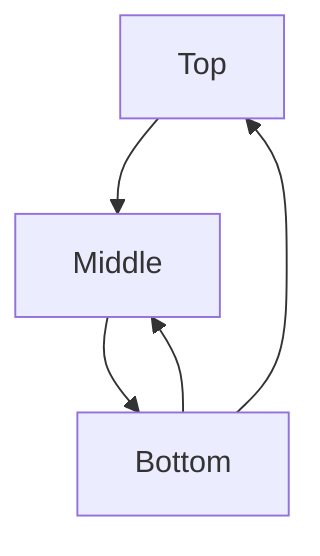

**Rendered output:**
```
     ┌─────┐
     │ Top │
     └─────┘
       │ ▲
      ┌┘ └──┐
      ▼     │
┌────────┐  │
│ Middle │  │
└────────┘  │
     ▲      │
     │      │
     │ ┌────┘
┌────────┐
│ Bottom │
└────────┘
```

**Overlaps found:** None. The backward edges `C-->A` and `C-->B` exit from different faces/positions. `C-->B` goes up on the left side of the column, `C-->A` goes up on the right side with a horizontal offset. These are well-separated.

---

### 5. `fan_in.mmd` (TD) -- OVERLAP FOUND

**Source:**
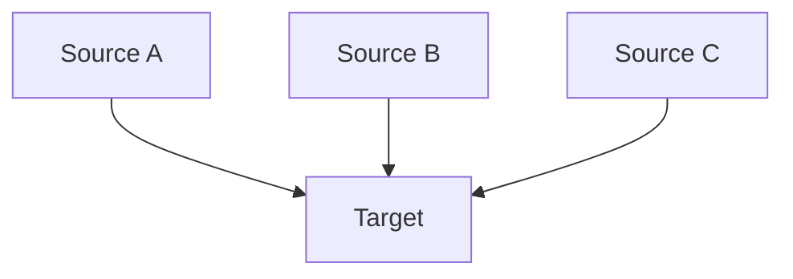

**Rendered output:**
```
┌──────────┐    ┌──────────┐    ┌──────────┐
│ Source A │    │ Source B │    │ Source C │
└──────────┘    └──────────┘    └──────────┘
        │           │           │
        └──┐   ┌─┬──┴───────────┘
           ▼   ▼ ▼
        ┌────────┐
        │ Target │
        └────────┘
```

**Overlaps found:**
1. **`▼   ▼ ▼` at Target top face**: Three forward edges arrive at Target. `Source A`'s arrow is separated from the others, but `Source B` and `Source C` have their arrows in adjacent cells (`▼ ▼` with a single space). Note the junction row `┌─┬──┴` -- the `┬` is the split point for B, and the arrows for B and C land at adjacent positions. This is a **forward-forward same-face** near-overlap between B's and C's edges.

---

### 6. `fan_out.mmd` (TD) -- OVERLAP FOUND

**Source:**
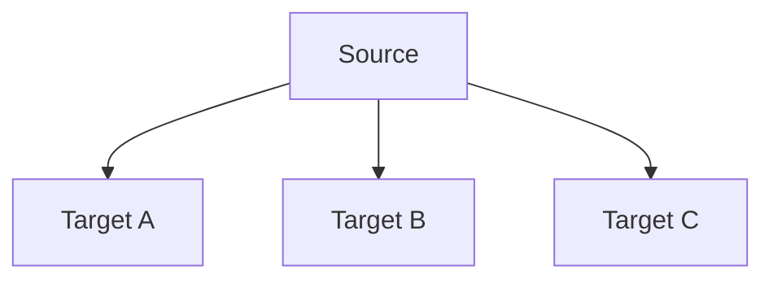

**Rendered output:**
```
        ┌────────┐
        │ Source │
        └────────┘
           │   │ │
        ┌──┘   └─┴──┬───────────┐
        ▼           ▼           ▼
┌──────────┐    ┌──────────┐    ┌──────────┐
│ Target A │    │ Target B │    │ Target C │
└──────────┘    └──────────┘    └──────────┘
```

**Overlaps found:**
1. **`│ │` at Source bottom face**: Two edges depart Source's bottom face from adjacent cells with zero spacing. The second and third edges from Source exit at positions `│ │` (no space between). This is a **forward-forward same-face** overlap on the departure side (Source's bottom face).

---

### 7. `five_fan_in.mmd` (TD) -- OVERLAP FOUND

**Source:**
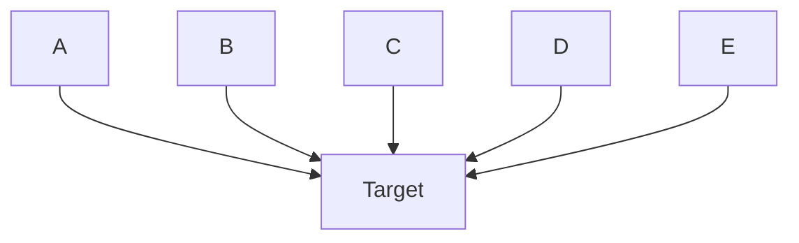

**Rendered output:**
```
┌───┐   ┌───┐   ┌───┐   ┌───┐   ┌───┐
│ A │   │ B │   │ C │   │ D │   │ E │
└───┘   └───┘   └───┘   └───┘   └───┘
    │      │     │      │       │
    └─────┐└┐ ┌─┬┴──────┴───────┘
          ▼ ▼ ▼ ▼
       ┌────────┐
       │ Target │
       └────────┘
```

**Overlaps found:**
1. **`▼ ▼ ▼ ▼` at Target top face**: Four arrows arrive in a tight cluster. Examining the arrow row: `▼ ▼ ▼ ▼` -- these are in positions with single-space gaps between them. The 5th edge (from A) shares a position or is very close. The junction row shows `└┐ ┌─┬┴──────┴` suggesting edges B and C (positions `▼ ▼`) are in adjacent cells. This is a **forward-forward same-face** overlap with multiple edges crowded into a small area.

---

### 8. `narrow_fan_in.mmd` (TD) -- OVERLAP FOUND

**Source:**
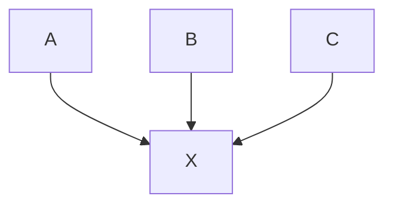

**Rendered output:**
```
┌───┐   ┌───┐   ┌───┐
│ A │   │ B │   │ C │
└───┘   └───┘   └───┘
   │     │      │
   └──┐ ┌┼──────┘
      ▼ ▼▼
     ┌───┐
     │ X │
     └───┘
```

**Overlaps found:**
1. **`▼▼` at X top face**: The junction row shows `┌┼` which indicates edge collision -- the `┼` means two edges cross at the same cell. Then `▼ ▼▼` shows B's arrow separated from A's, but B and C have zero-gap arrows (`▼▼`). This is a **forward-forward same-face** overlap. The target node X is only 5 chars wide (`┌───┐`), so there is very little room for 3 attachment points.
2. **`┼` junction collision**: The routing row has a `┼` character indicating two edge segments cross at the same cell. This is an **edge path crossing overlap** (not just an attachment point issue).

---

### 9. `diamond_fan.mmd` (TD) -- NO OVERLAP

**Source:**
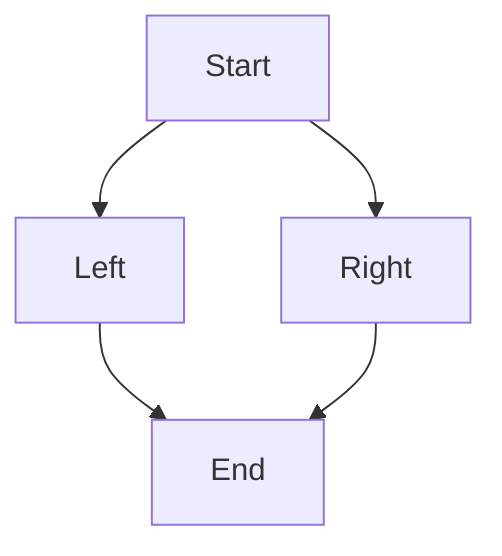

**Rendered output:**
```
   ┌───────┐
   │ Start │
   └───────┘
      │  │
     ┌┘  └────┐
     ▼        ▼
┌──────┐    ┌───────┐
│ Left │    │ Right │
└──────┘    └───────┘
     │        │
     └┐  ┌────┘
      ▼  ▼
    ┌─────┐
    │ End │
    └─────┘
```

**Overlaps found:** None. The fan-out from Start is well-separated (different columns). The fan-in to End shows `▼  ▼` with good spacing. This is a clean rendering.

---

### 10. `complex.mmd` (TD) -- NO OVERLAP

**Source:**
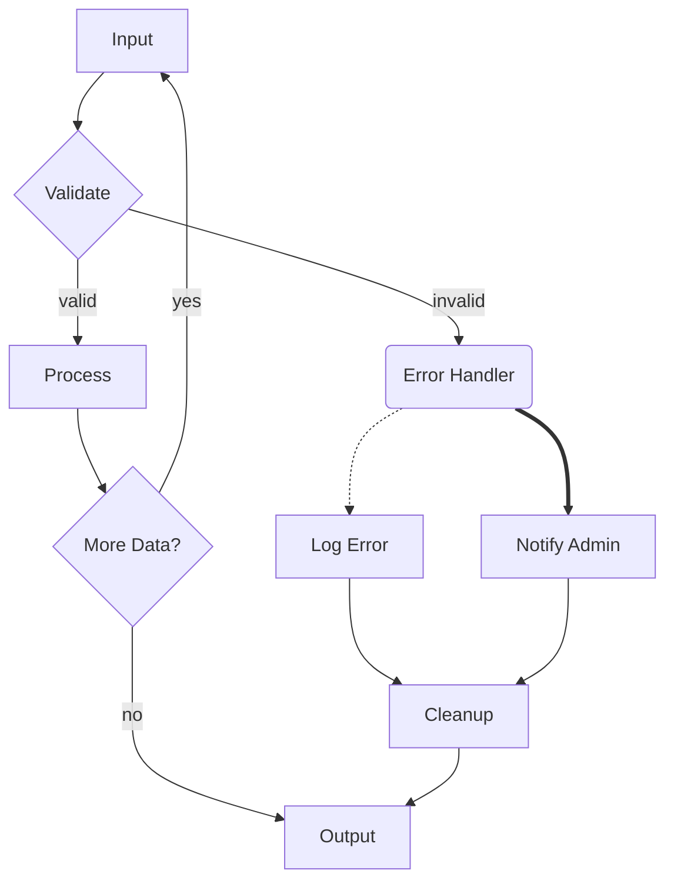

**Rendered output:**
```
  ┌───────┐
  │ Input │
  └───────┘
      │ ▲
      │ │
      │ └───────┐
      │         │
      ▼         │
┌──────────┐    │
< Validate >    │
└──────────┘    │
      │  │      │
      │  │  yes │
valid │  └──────┼──────────┐
      │         │          │ invalid
      ▼         │          ▼
 ┌─────────┐    │       ╭───────────────╮
 │ Process │    │       │ Error Handler │
 └─────────┘    │       ╰───────────────╯
       │        │                │   │
       │        │                │   │
       └──┐     │                └┐  └─────────────────┐
          │     │                 │                    │
          ▼ ┌───┘                 ▼                    ▼
    ┌────────────┐           ┌───────────┐          ┌──────────────┐
    < More Data? >           │ Log Error │          │ Notify Admin │
    └────────────┘           └───────────┘          └──────────────┘
          ┌┘                      │                    │
          │                       │                    │
          │ no                   ┌┘  ┌─────────────────┘
          │                      │   │
          │                      ▼   ▼
          │                ┌─────────┐
          │                │ Cleanup │
          │                └─────────┘
          └─────────┐         │
                    │         │
                    │   ┌─────┘
                    │   │
                    ▼   ▼
                 ┌────────┐
                 │ Output │
                 └────────┘
```

**Overlaps found:** None visible. The fan-in cases (Cleanup receiving from Log Error and Notify Admin, Output receiving from More Data? and Cleanup) all have adequate spacing between arrows (`▼   ▼`). The backward edge `E-->|yes|A` is well-separated from the forward edge. The `┼` at one point is a proper crossing symbol (the backward edge crosses the label-carrying forward edge).

---

### 11. `ci_pipeline.mmd` (LR) -- NO OVERLAP

**Source:**
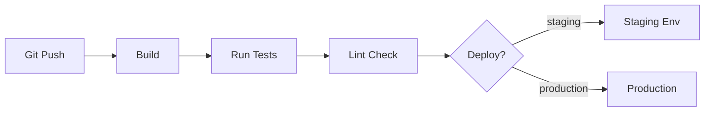

**Rendered output:**
```
                                                                                                                                 ┌─────────────┐
                                                                                                                                 │ Staging Env │
┌──────────┐              ┌───────┐              ┌───────────┐              ┌────────────┐              ┌─────────┐  staging     └─────────────┘
│ Git Push │─────────────►│ Build │─────────────►│ Run Tests │─────────────►│ Lint Check │─────────────►< Deploy? >──────────────┐
└──────────┘              └───────┘              └───────────┘              └────────────┘              └─────────┘ production   ▼
                                                                                                                                 ┌────────────┐
                                                                                                                                 │ Production │
                                                                                                                                 └────────────┘
```

**Overlaps found:** None. The linear chain is well-separated. The two fan-out edges from Deploy go to different rows and are properly spaced.

---

### 12. `fan_in_lr.mmd` (LR) -- RENDERING DEFECT (bonus)

**Rendered output:**
```
┌───────┐
│ Src A │
└───────┘    ▲
        └────┌────────┐
        ┌────│ Target │
┌───────┐    └────────┘
│ Src B │    ▼ ▲
└───────┘      │
               │
       ┌───────┘
┌───────┐
│ Src C │
└───────┘
```

**Overlaps found:** This fixture has a more fundamental rendering problem -- the arrows point in wrong directions (`▲` instead of `►`) and the edge routing draws over the node border (`└────┌────────┐` and `┌────│ Target │`). The `▼ ▲` on a single line next to Target suggests both a downward and upward arrow sharing the same attachment area. This appears to be a **rendering bug** beyond simple overlap, likely in the LR edge routing logic.

---

### 13. `simple_cycle.mmd` (TD) -- NO OVERLAP (bonus)

**Rendered output:**
```
    ┌───────┐
    │ Start │
    └───────┘
       │ ▲
      ┌┘ └─┐
      ▼    │
┌─────────┐│
│ Process ││
└─────────┘│
      │    │
      └┐   │
       ▼ ┌─┘
     ┌─────┐
     │ End │
     └─────┘
```

**Overlaps found:** None. The forward edge and backward edge are well-separated, using different sides of the column for routing.

## How

**Methodology:**

1. Rendered each fixture using `cargo run -q -- tests/fixtures/<name>.mmd`
2. Examined each output for:
   - **Arrow adjacency**: Looked for `▼▼`, `▲▲`, `►►`, `◄◄` (zero-gap arrows) and `▼ ▼` (single-space-gap arrows)
   - **Path sharing**: Looked for `┼` (crossing symbol) indicating two edges using the same cell
   - **Attachment crowding**: Counted how many edges enter/exit the same face of a node and checked whether the arrows were visually distinguishable
3. Categorized overlaps by type:
   - **Forward-forward same-face**: Multiple forward (downward in TD) edges arriving at the same face
   - **Forward-backward**: A forward edge and a backward (upward in TD) edge at the same attachment point
   - **Backward-backward**: Multiple backward edges at the same attachment point
4. Assessed severity: zero-gap (`▼▼`) vs single-space-gap (`▼ ▼`) vs well-separated (`▼  ▼` or more)

## Why

This tells us the remaining problem scope is concentrated in a specific pattern: **forward-forward same-face overlaps on the arrival side** of fan-in and skip-edge topologies. The pattern occurs when:

1. A node receives multiple edges from above (TD) and the target node is narrow relative to the number of incoming edges
2. Skip edges (edges that span multiple ranks) converge with direct edges at the same node
3. The target node's width doesn't provide enough attachment points to spread arrows apart

The departure side (fan-out) has a similar but milder issue (`fan_out.mmd` shows `│ │` at Source's bottom).

Backward edges are NOT a source of overlap in any current fixture. The cycle-handling code properly separates backward edges from forward edges.

LR direction has a separate, more fundamental rendering problem (garbled output in `fan_in_lr.mmd`) that is outside the scope of attachment spreading.

## Key Takeaways

- **6 of 11 fixtures** show some form of forward-forward same-face overlap or near-overlap
- **Zero-gap overlaps** (`▼▼`): `double_skip.mmd` (at End), `stacked_fan_in.mmd` (at Bot), `narrow_fan_in.mmd` (at X)
- **Single-space-gap near-overlaps** (`▼ ▼`): `skip_edge_collision.mmd` (at End), `fan_in.mmd` (at Target), `five_fan_in.mmd` (at Target)
- **Departure-side overlap** (`│ │`): `fan_out.mmd` (at Source bottom)
- **No backward-backward or forward-backward overlaps** found in any fixture
- **All overlaps are in TD direction** -- LR has a different rendering bug
- The common factor is a **narrow target node receiving multiple edges**, especially when skip edges are involved
- `diamond_fan.mmd` and `complex.mmd` demonstrate that when nodes are wide enough and edges come from different horizontal positions, the spreading works correctly

## Open Questions

- Should single-space-gap (`▼ ▼`) be considered acceptable, or does it need further spreading too?
- For narrow nodes (e.g., `┌───┐` = 5 chars wide), is it physically possible to spread 3 attachment points? The minimum node width may impose a hard limit.
- The `fan_in_lr.mmd` rendering defect suggests LR edge routing has fundamental issues beyond attachment spreading -- is that a separate concern?
- Does the departure-side overlap (fan_out `│ │`) need the same fix, or is it less visually confusing since the lines merge into a routing structure immediately below?
- The `┼` crossing in `narrow_fan_in.mmd` suggests path overlap, not just attachment overlap -- does the router need to detect and avoid shared cells?
