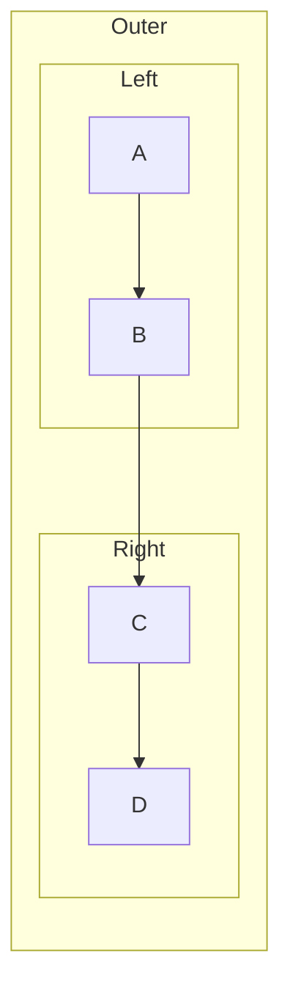

# Research: Subgraph Direction Inheritance

## Status: ARCHIVED

**Archived:** 2026-01-29

---

## Goal

Understand how Mermaid handles direction inheritance for subgraphs, and document mmdflux's intentional deviation from Mermaid's default behavior.

## Context

When rendering `nested_with_siblings.mmd` (`graph LR` with nested sibling subgraphs), mmdflux and Mermaid produce different layouts. mmdflux inherits the graph-level `LR` direction for subgraphs, while Mermaid defaults subgraphs to TD regardless of the graph-level direction.

**Test case:**

- **Mermaid (default):** Renders top-down — subgraphs stacked vertically, nodes flow TD within each subgraph.
- **Mermaid (with `direction LR` on outer):** Renders left-to-right — matches mmdflux output.
- **mmdflux:** Renders left-to-right — inherits `LR` from graph declaration.

## Questions

### Q1: Is Mermaid's subgraph direction default intentional or a bug?

**Where:** Mermaid GitHub issues and PRs
**What:** Whether the TD default for subgraphs (ignoring graph-level direction) is by design
**How:** Search issues, PRs, and maintainer comments
**Why:** Determines whether mmdflux should match this behavior or intentionally deviate

**Output file:** `q1-mermaid-direction-behavior.md`

## Sources

| Source | Location | Used by |
|--------|----------|---------|
| Mermaid GitHub | https://github.com/mermaid-js/mermaid | Q1 |
| PR #6435 | https://github.com/mermaid-js/mermaid/pull/6435 | Q1 |
| PR #6470 | https://github.com/mermaid-js/mermaid/pull/6470 | Q1 |
| Issue #2509 | https://github.com/mermaid-js/mermaid/issues/2509 | Q1 |
| Issue #6428 | https://github.com/mermaid-js/mermaid/issues/6428 | Q1 |

## Expected Outputs

| File | Question | Status |
|------|----------|--------|
| `q1-mermaid-direction-behavior.md` | Q1: Mermaid's direction default | Complete |
| `synthesis.md` | Combined findings | Complete |
